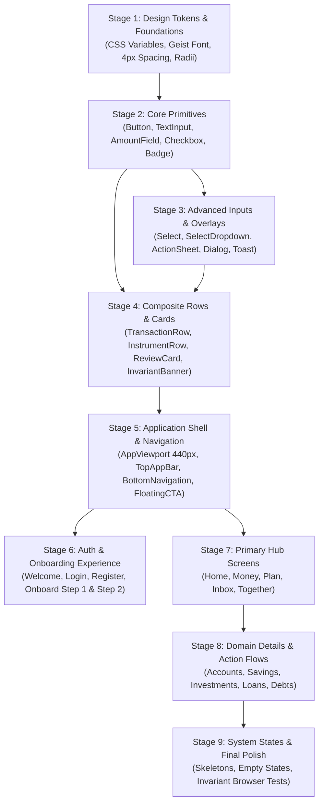

# Implementation Order & Dependency Graph — ViNha Design System

**Target Architecture**: Next.js 16 App Router + Tailwind CSS + HeroUI v3 + React Hook Form + Zod  
**Governance Strategy**: Bottom-up dependency graph ensuring zero circular dependencies and 100% component readiness before screen assembly.

---

## 1. High-Level Dependency Graph

---

## 2. Step-by-Step Implementation Sequence

### Stage 1: Design Tokens & Foundations

- **Target Files**: `app/globals.css`, `tailwind.config.ts`, `shared/ui/tokens.ts`.
- **Deliverables**:
  - CSS custom properties for Light (`#FAFAF9` canvas, `#FFFFFF` surface) and Dark (`#141416` canvas, `#1C1C1F` surface).
  - Semantic color aliases (`primary-brand`, `income-emerald`, `expense-slate`, `debt-rose`, `transfer-sky`, `warning-amber`).
  - Corner radius tokens: `10px` (`rounded-[10px]` controls), `12px/14px` (`rounded-xl` cards), `16px` (`rounded-2xl` sheets).
  - Geist Sans configuration with `tabular-nums` default for monetary digits.
  - 44px minimum touch target utility class.

### Stage 2: Core Primitives

- **Target Directory**: `shared/ui/`.
- **Deliverables**:
  - `Button`: Primary, Tonal, Outlined, Destructive, Ghost with 6 interactive states (Default, Hover, Pressed, Focus, Loading, Disabled).
  - `IconButton`: 44×44px touch targets with accessible ARIA labels.
  - `TextInput`: 44px standard input, error message association (`aria-describedby`).
  - `PasswordInput`: Integrated show/hide eye toggle with accessible label.
  - `AmountField`: Vietnamese Dong tabular entry with period thousand separators.
  - `Checkbox`, `Switch`, `Radio`: Form controls matching Task 11 styling.
  - `StatusBadge`: 22px pill badges across 5 semantic states.

### Stage 3: Form Architecture & Overlays

- **Target Directories**: `shared/ui/form/`, `shared/patterns/`.
- **Deliverables**:
  - `Select` & `SelectDropdown`: Closed trigger and floating popover listbox (`role="listbox"`, `aria-activedescendant`).
  - `ChoiceTile` & `ChoiceTileGroup`: Rich selectable tiles for onboarding presets and household policies.
  - `HeroCurrencyInput`: 36px/32px input with real-time Vietnamese verbal pronunciation readout.
  - `QuantityInput`: Tabular fractional entry with inline `MAX` button.
  - `ActionSheet`: Accessible half-sheet drawer with dimmed backdrop, drag handle, and scrollable content.
  - `Dialog`: Accessible confirmation dialogs.
  - `Toast`: Transient feedback notifications.

### Stage 4: Composite Rows & Cards

- **Target Directory**: `shared/patterns/`.
- **Deliverables**:
  - `TransactionRow`: Expense (− Rose), Income (+ Emerald), and Transfer (↔ Sky) rows with tabular amounts.
  - `InstrumentRow`: Bank checking, savings, loan, and credit card rows with 40×40px badge containers.
  - `MemberRow`: Household member row with avatar and Admin/Partner badge.
  - `ReviewCard`: Inbox attention card with status pills and deep link triggers.
  - `Card`: Surface container with 1px border.
  - `InvariantBanner`: P0 blue callout banner for ledger boundaries.
  - `ProgressBar`: Clamped 4px / 6px ratio bar with semantic color styling.

### Stage 5: Application Shell & Navigation

- **Target Directory**: `shared/patterns/`.
- **Deliverables**:
  - `AppViewport`: Fixed 440px desktop centered container, 100% width on mobile viewports.
  - `TopAppBar`: 56px sticky top bar with back navigation, titles, role badges, and search affordance.
  - `BottomNavigation`: 5-tab docked bar (`Home`, `Money`, `Plan`, `Inbox`, `Together`) with 56px touch slots.
  - `FloatingAddCTA`: 44px floating pill button docked 16px above bottom navigation.
  - `LocaleSwitcher`: Quiet language switcher (VI / EN).

### Stage 6: Unauthenticated Entry & Auth Flow

- **Target Routes**: `app/[locale]/(auth)/` & `app/[locale]/(onboard)/`.
- **Screens**:
  1. `/welcome` (`SCR-51`): Preview card, value pillars, entry CTAs.
  2. `/login` (`SCR-52`): Social buttons, credentials form, password recovery link.
  3. `/register` (`SCR-53`): Registration form, password validation, terms consent.
  4. `/together/onboard` Step 1 (`SCR-54`): Household naming with start-alone reassurance.
  5. `/together/onboard` Step 2 (`SCR-55`): Cash account, P0 opening balance invariant notice, plan presets, skip options.

### Stage 7: Primary Hub Screens

- **Target Routes**:
  1. `/home` (`SCR-01`): Total assets hero, cash flow chart, 4 Money pillars, activity feed.
  2. `/money` (`SCR-02`): Consolidated position, asset allocation bar, 5 domain cards.
  3. `/plan` (`SCR-35`): Budget hero, 6 envelope jars, overspend alert, upcoming outflows.
  4. `/inbox` (`SCR-41`): 14 pending items queue, segmented switcher, ReviewCards.
  5. `/together` (`SCR-46`): Household hub, member avatars, partner invite, policy links.

### Stage 8: Domain Details & Action Flows

- **Sub-domains**:
  - **Accounts**: Overview (`SCR-07`), Add Account (`SCR-09`), Add Credit (`SCR-10`), Asset Detail (`SCR-11`), Credit Detail (`SCR-12`).
  - **Savings**: Overview (`SCR-08`), Add Wizard (`SCR-13`), Contract Detail (`SCR-14`), Providers (`SCR-15`), Add Provider (`SCR-16`).
  - **Investments**: Overview (`SCR-17`), Add Wizard (`SCR-18`), Detail (`SCR-19`), Buy (`SCR-20`), Sell (`SCR-21`), Valuation (`SCR-22`).
  - **Loans**: Overview (`SCR-23`), Add Wizard (`SCR-24`), Detail (`SCR-25`), Record Payment (`SCR-26`), Schedule (`SCR-27`), Payoff (`SCR-28`).
  - **Personal Lending**: Overview (`SCR-29`), Create Wizard (`SCR-30`), Detail Lent (`SCR-31`), Detail Borrowed (`SCR-32`), Record Payment (`SCR-33`), Edit (`SCR-34`).
  - **Plan**: Jar Detail (`SCR-36`), Create Jar (`SCR-37`), Adjust Allocation (`SCR-38`), History (`SCR-39`), Review Ritual (`SCR-40`).
  - **Inbox & Together**: Item Detail (`SCR-42`, `SCR-43`), Archived (`SCR-44`), Empty (`SCR-45`), Members (`SCR-47`), Invites (`SCR-48`), Policies (`SCR-49`), Remove Confirm (`SCR-50`).

### Stage 9: System States & Final Polish

- Loading skeleton states matching exact row geometries.
- Empty states with dignified illustrations and clear copy.
- Comprehensive browser validation at 360px, 390px, 440px, and 1280px viewports across Light and Dark themes.
