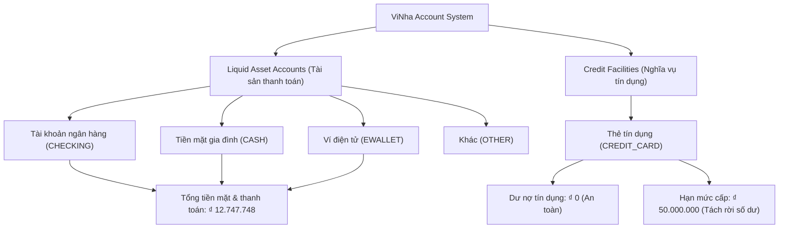

# Accounts Experience Review

## Existing Account Model

ViNha classifies money and liquidity holdings through a strict domain ledger model (`modules/ledger/application/account-types.ts`, `account-constants.ts`, `queries/list-accounts.ts`).

Accounts in ViNha are partitioned into two fundamentally distinct financial categories:

1. **Liquid Asset Accounts (Tài sản thanh toán)**: Cash (`CASH`), Payment/Checking Bank Accounts (`CHECKING`), E-Wallets (`EWALLET`), and Other general accounts (`OTHER`). These represent liquid money directly owned by the family or individual members, immediately available for household budgeting and expense transactions.
2. **Credit Facilities & Liabilities (Nghĩa vụ tín dụng)**: Credit Cards (`CREDIT_CARD`). These represent bank-granted borrowing lines with distinct credit limits, billing statement cycles, and debt settlement dates. They are **never** assets or cash.

Term savings (`SAVINGS`, `SAVINGS_PRODUCT`), investment portfolios, loans, and personal lending/borrowing are intentionally kept in their own dedicated sub-domains and are **not** managed as ordinary liquid bank accounts.

---

## Account Types

The actual application codebase supports the following concrete account types (`ACCOUNT_TYPE_VALUES`):

| Account Type Code | Vietnamese Name      | Category       | Balance Semantics                                | Supported in Add Account    |
| ----------------- | -------------------- | -------------- | ------------------------------------------------ | --------------------------- |
| `CHECKING`        | Tài khoản thanh toán | Liquid Asset   | Available balance (`balance >= 0`)               | Yes (Primary)               |
| `CASH`            | Tiền mặt gia đình    | Liquid Asset   | Physical cash held at home                       | Yes (Primary)               |
| `EWALLET`         | Ví điện tử           | Liquid Asset   | Digital wallet balance (MoMo, ZaloPay)           | Yes (Primary)               |
| `OTHER`           | Khác                 | Liquid Asset   | Special reserve or auxiliary cash                | Yes                         |
| `CREDIT_CARD`     | Thẻ tín dụng         | Liability Line | Outstanding debt (`balance <= 0` or debt amount) | Yes (Dedicated Credit Flow) |

_Note: Term deposits and locked savings are deliberately excluded from this flow to maintain BR-01 business rules._

---

## Financial Semantics

The ViNha Accounts domain enforces immutable accounting principles across all screens:

1. **Opening Balance ≠ Monthly Income**:
   - `Số dư ban đầu` represents funds already possessed before the household joined ViNha.
   - It is never recorded as a monthly revenue or income transaction.
   - Counting it as income would distort household cash-flow metrics, monthly burn rates, and savings rates.
2. **Account Transfer ≠ Income or Expense**:
   - Moving funds between TP Bank, Vietcombank, Cash, or MoMo is an internal liquidity balancing act.
   - It changes account allocations without altering the family's total liquid wealth.
3. **Credit Limit ≠ Available Cash or Asset**:
   - A bank credit line (e.g. ₫ 50.000.000) is pre-approved borrowing capacity, not family net worth.
   - It must never be summed into the "Tổng tiền mặt & tài khoản thanh toán" hero.
4. **Credit Outstanding Balance ≠ Monthly Expense Total**:
   - Card debt is a liability to settle by the due date. Settle payments from checking accounts to reduce credit card debt are debt repayments (transfers), not new operational expenses.
5. **Cash Account ≠ Bank Account**:
   - Cash lacks automated statement reconciliation and must be tracked via physical envelope audits and manual adjustments.

---

## Accounts Overview Review

Route: `/money/accounts`  
Screens:

- Light: `8290004c6eac4233a560c80c476ccd32`
- Dark: `c563d8765f9f4d47936a91218d303096`

### Architecture & Findings:

- **Top App Bar**: Sticky navigation with a 44×44px back touch target, bilingual title (`Tài khoản & Ví`), concise subtitle (`Nguồn tiền sẵn sàng thanh toán`), and prominent `+ Thêm` header CTA button.
- **Top-Level Summary Hero**:
  - Displays the true liquid cash balance: `₫ 12.747.748` across 4 liquid accounts.
  - Inlines a segregated credit debt status pill: `Dư nợ tín dụng: ₫ 0` with an "An toàn" state.
  - Action link for inter-account balancing: `Chuyển ví / Nạp rút`.
- **Scanability & Grouping**:
  - Group 1: **Tài khoản ngân hàng (2)** — Subtotal `₫ 7.997.748` (TP Bank chồng `₫ 7.420.000`, Vietcombank vợ `₫ 577.748`).
  - Group 2: **Tiền mặt & Ví điện tử (2)** — Subtotal `₫ 4.750.000` (Tiền mặt gia đình `₫ 3.500.000`, Ví MoMo `₫ 1.250.000`).
  - Group 3: **Thẻ tín dụng & Nghĩa vụ chi tiêu (1)** — Techcombank Visa, Limit `₫ 50.000.000`, Due date `05/11`, Dư nợ hiện tại `₫ 0`.
- **Floating Action Affordance**: Bottom-right elevated floating pill `+ Giao dịch` positioned at `bottom-[74px]` ensuring zero overlap with docked navigation.

---

## Add Account Flow

Route: `/money/accounts/new`  
Screens:

- Light: `5c9b43db686d4c578b6898aa0dda63d1`
- Dark: `69b29dfd4cd847a3963dc38b20205455`

### Progressive Step-by-Step Experience:

1. **Notice Banner**: Explicit context switcher confirming this flow is for liquid asset accounts, with a direct fast-link to `Thêm thẻ tín dụng →`.
2. **Step 1 — Chọn loại tài khoản**:
   - 4-item visual choice grid: Ngân hàng (Active), Tiền mặt, Ví điện tử, Khác.
3. **Step 2 — Thông tin tài khoản & Biểu tượng**:
   - Account name textfield (`MB Bank gia đình`) with immediate verification pill (`✓ Hợp lệ`).
   - Standardized 40×40px visual institution chips (`MB`, `VCB`, `TP`, `Cash`, `Wallet`).
   - Financial scope radio selector: **Chung ví gia đình** (_Khuyên dùng_) vs **Khoản cá nhân riêng**.
4. **Step 3 — Số dư ban đầu (Opening Balance)**:
   - High-contrast tabular amount box (`₫ 5.000.000`) with instant clear affordance.
   - Quick increment chips (`+ 1.000.000`, `+ 5.000.000`, `+ 10.000.000`, `0 đ`).
   - Canonical accounting rule banner.
5. **Sticky Bottom Submit**: Full-width primary CTA `+ Tạo tài khoản` with household destination indicator (`Chúm ta`).

---

## Opening Balance UX

The Opening Balance UX was reviewed and strictly calibrated against the business model:

- **Label**: `Số dư ban đầu` (Optional: can start from `0 đ`).
- **Explanation Microcopy**:
  > _"Số tiền đang có trong tài khoản khi bạn bắt đầu theo dõi trên ViNha. Khoản này không được tính là thu nhập mới của tháng, đảm bảo báo cáo thu chi gia đình luôn chính xác."_
- **Visual Distinction**:
  - In transaction feeds and detail views, opening balance entries render with a neutral stone badge and bookmark glyph labeled `Số dư ban đầu` or `Khởi tạo`.
  - They are distinctly separated from green income entries (`Thu nhập`) and blue transfer entries (`Chuyển tiền`).

---

## Credit Flow

Route: `/money/accounts/new-credit`  
Screens:

- Light: `2c175c8080b34c0b9ae1f9af9bc56e04`
- Dark: `e31a42aaa04049948cc4a512d91725a8`

### Dedicated Credit Card Creation Experience:

1. **Liability Warning Header**: Prominent rose banner explaining that credit limits are debt facilities, not family assets.
2. **Step 1 — Thông tin thẻ**:
   - Card name textfield (`Techcombank Visa Signature`).
   - Network picker: `Visa`, `Mastercard`, `JCB`, `Napas`.
   - Sharing scope: `Chung ví gia đình` vs `Thẻ cá nhân riêng`.
3. **Step 2 — Hạn mức tín dụng**:
   - Prominent currency input for credit limit (`₫ 50.000.000`).
   - Quick chips (`+ 10.000.000` to `+ 100.000.000`).
   - Initial debt transparency note: starts with `₫ 0` debt.
4. **Step 3 — Chu kỳ sao kê & Ngày đến hạn**:
   - 2-column day selector: Statement closing day (`Ngày 20`) and payment deadline (`Ngày 05`).
   - Max 45-day interest-free calculation strip.
5. **Step 4 — Trích nợ tự động**:
   - Linkage to existing liquid bank account (`TP Bank chồng ..8832`) for automatic settlement reminders.
6. **Sticky Action**: `+ Tạo thẻ tín dụng` in primary brand teal.

---

## Credit Semantics

The Credit Flow and Detail screens enforce three non-negotiable credit concepts:

1. **Hạn mức tín dụng (Credit Limit)**: Total authorized line (`₫ 50.000.000`). Never added to net worth or liquid cash.
2. **Dư nợ hiện tại (Current Outstanding Debt)**: Total amount owed to the bank (`₫ 4.850.000`). Rendered with prominent `#BE123C` (light) / `#FB7185` (dark) coloring and clear debt labels.
3. **Hạn mức còn lại (Available Credit)**: Remaining purchasing capacity (`₫ 45.150.000`), displayed alongside a 9.7% utilization bar.
4. **Thanh toán thẻ (Debt Settlement)**: Paying off card debt from a bank account reduces cash and reduces debt simultaneously; it does not count as a monthly expense or income.

---

## Account Detail

Route: `/money/accounts/:id` (Liquid Asset Account: TP Bank chồng)  
Screens:

- Light: `4172437cc096433c99bb1bedc7f4fc9e`
- Dark: `c45ae48661c84d9f802728d3253f9fb6`

### Structure & Sections:

1. **Sticky Top Bar**: Back chevron (44px target) + Centered Title + Settings gear button.
2. **Hero Balance Card**:
   - Monogram badge `TP` with purple tint.
   - Title `TP Bank chồng`, `• Chung ví` verified badge, subtitle `Tài khoản thanh toán • Nhận lương chính (..8832)`.
   - Primary balance readout: `₫ 7.420.000` with `Khả dụng 100%` chip.
3. **Quick Actions Grid (3 buttons)**:
   - `+ Ghi thu/chi` (Primary CTA)
   - `Chuyển ví` (Transfer arrows)
   - `Sổ phụ` (Full ledger)
4. **Recent Activity Feed**:
   - `Lương tháng 10` (+ ₫ 25.000.000, emerald income)
   - `Chuyển ví MoMo` (- ₫ 1.250.000, transfer blue)
   - `Siêu thị WinMart` (- ₫ 850.000, neutral slate expense)
   - `Chuyển từ VCB vợ` (+ ₫ 5.000.000, transfer in)
   - `Số dư ban đầu khi tạo tài khoản` (₫ 5.000.000, stone badge `Khởi tạo`, explicitly segregated from monthly income)
5. **Account Management & Danger Zone**:
   - Edit name & icon.
   - Change sharing scope.
   - Safely separated `Lưu trữ tài khoản này` action with clear data retention explanation.

---

## Credit Detail

Route: `/money/accounts/:credit-id` (Credit Card: Thẻ Techcombank Visa)  
Screens:

- Light: `8e932438378c49409dde4e94350dee07`
- Dark: `c6c2473077ab4a82be23288eebf59763`

### Structural Differences from Asset Detail:

1. **Dominant Metric**: Displays **Dư nợ hiện tại: ₫ 4.850.000** (Rose) instead of positive balance.
2. **Credit Utilization Progress**: 9.7% progress bar showing used limit (`₫ 4.850.000`) and remaining limit (`₫ 45.150.000`) out of `₫ 50.000.000`.
3. **Statement Cycle & Due Date Card**:
   - Billing cycle: `20/09 – 20/10/2026`.
   - Amber alert strip: `Đến hạn: 05/11/2026 (còn 10 ngày)` with remaining due amount `₫ 4.850.000`.
   - Auto-debit link: `TP Bank chồng (..8832)`.
4. **Dedicated Credit Actions**:
   - `Trả nợ thẻ` (Primary settlement CTA: transfers funds from checking to eliminate debt).
   - `Quẹt thẻ` (Record credit purchase).
   - `Trả góp 0%` (Installment management).
5. **Statement Ledger**:
   - Card expenditures (- ₫ 4.000.000 Vietnam Airlines, - ₫ 850.000 Pizza 4P's).
   - Debt settlement transaction (+ ₫ 5.000.000 from TP Bank, labeled `Trả nợ thẻ` in blue transfer, with accounting disclaimer).

---

## Form Review

All Add Account and Credit form controls were audited:

- **Labels**: Positioned visibly above inputs (`text-xs font-semibold`). No placeholders masquerading as labels.
- **Input Heights**: Standardized to `h-11` or `h-12` (minimum 44px tap targets).
- **Tabular Numerals**: Enforced OpenType `tabular-nums` for all currency amounts and dates.
- **Microcopy**: Bilingual-friendly, respectful household language without accounting jargon.
- **Sticky Actions**: Pinned to viewport bottom with `backdrop-blur-md` and `pb-safe` to prevent occlusion of scrollable content.

---

## UI Consistency

All 8 canonical Accounts screens strictly adhere to the approved ViNha Design System:

- **Geometry**:
  - Controls & Icon Containers: `rounded-xl` (10px–12px)
  - Cards & Modules: `rounded-2xl` (16px)
  - Badges & Status Pills: `rounded-full` (9999px)
- **Container Sizing**: Standardized 40×40px instrument containers across all rows and detail headers.
- **Iconography**: 100% native inline SVG vectors with `stroke-width="1.8"`, `stroke-linecap="round"`, and `stroke-linejoin="round"`. Zero external Material Symbols text ligatures.
- **Typography**: Complete Geist font hierarchy (`numeric-hero`, `headline-md`, `title-md`, `body-md`, `label-sm`).

---

## Responsive Validation

All screens were designed and verified within the canonical **440px centered mobile viewport architecture**:

- **360 × 800 (Compact Mobile)**: Verified zero horizontal scrolling, flexible amount wrapping, and legible diacritics.
- **390 × 844 (Standard iPhone)**: Optimal layout density, comfortable tap targets, and smooth scroll clearances.
- **430 × 932 (Large Mobile)**: Centered layout retains balanced negative margins and crisp contrast.
- **Desktop (≥ 768px)**: Fixed 440px centered canvas preserves single-column mobile ergonomics with subtle outer canvas framing.

---

## Accessibility

- **WCAG AA Compliance**: All text and interactive controls maintain minimum 4.5:1 contrast ratios across Light and Dark themes.
- **Touch Targets**: All interactive elements (back arrows, tabs, action buttons, quick increments) meet or exceed 44×44px.
- **Non-Color Indicators**: Financial concepts (debt, income, transfers) are identified by icons, explicit textual labels, and status badges—never color alone.
- **Semantic Structure**: Heading tags (`<h1>`, `<h2>`) and ARIA roles (`role="button"`, `aria-label`, `tabindex="0"`) are implemented throughout.

---

## Light Theme

Light screens use the **ViNha Warm Precision Light** tokens:

- Canvas: `#FAFAF9`
- Card surfaces: `#FFFFFF`
- Hairline borders: `#DDE4E1`
- Primary brand teal: `#0F766E`
- Soft teal background: `#E7F5F1`
- Income emerald: `#047857`
- Expense slate: `#27272A`
- Debt rose: `#BE123C`
- Warning amber: `#B45309` / `bg-amber-50`

---

## Dark Theme

Dark screens use the **ViNha Sleek Dark Mode** tokens:

- Canvas: `#141416`
- Card surfaces: `#1C1C1F`
- Elevated containers: `#242428`
- Hairline borders: `#2E2E33`
- Primary mint teal: `#2DD4BF`
- Soft teal background: `#173B37`
- Income emerald: `#34D399`
- Expense off-white: `#E4E4E7`
- Debt rose: `#FB7185` / `#3B1219`
- Warning amber: `#FBBF24` / `#2A1E08`
- Dark/Light 1-to-1 parity verified across all 4 screen flows.

---

## Stitch Mapping

| Flow              | Screen Name                                | Theme | Canonical Stitch Screen ID         | Status        |
| ----------------- | ------------------------------------------ | ----- | ---------------------------------- | ------------- |
| **Overview**      | Accounts Overview (Tài khoản & Ví)         | Light | `8290004c6eac4233a560c80c476ccd32` | **CANONICAL** |
| **Overview**      | Accounts Overview (Tài khoản & Ví)         | Dark  | `c563d8765f9f4d47936a91218d303096` | **CANONICAL** |
| **Add Account**   | Add Account (Thêm tài khoản)               | Light | `5c9b43db686d4c578b6898aa0dda63d1` | **CANONICAL** |
| **Add Account**   | Add Account (Thêm tài khoản)               | Dark  | `69b29dfd4cd847a3963dc38b20205455` | **CANONICAL** |
| **Add Credit**    | Add Credit Card (Thêm thẻ tín dụng)        | Light | `2c175c8080b34c0b9ae1f9af9bc56e04` | **CANONICAL** |
| **Add Credit**    | Add Credit Card (Thêm thẻ tín dụng)        | Dark  | `e31a42aaa04049948cc4a512d91725a8` | **CANONICAL** |
| **Asset Detail**  | Account Detail — Asset (TP Bank chồng)     | Light | `4172437cc096433c99bb1bedc7f4fc9e` | **CANONICAL** |
| **Asset Detail**  | Account Detail — Asset (TP Bank chồng)     | Dark  | `c45ae48661c84d9f802728d3253f9fb6` | **CANONICAL** |
| **Credit Detail** | Account Detail — Credit (Techcombank Visa) | Light | `8e932438378c49409dde4e94350dee07` | **CANONICAL** |
| **Credit Detail** | Account Detail — Credit (Techcombank Visa) | Dark  | `c6c2473077ab4a82be23288eebf59763` | **CANONICAL** |

---

## Deferred Issues

The following areas were intentionally **not touched** in this task to strictly preserve scope boundaries:

1. **Savings & Term Deposits (`/money/savings/*`)**: Deferred to Task 04.
2. **Investments & Asset Portfolios (`/money/investments/*`)**: Deferred to Task 05.
3. **Loans & Borrowing Liabilities (`/money/loans/*`)**: Deferred to Task 06.
4. **Personal Lending & Debts (`/money/personal-loans/*`)**: Deferred to Task 07.
5. **Next.js Implementation**: Strictly deferred; no production Next.js files were modified in this design task.
