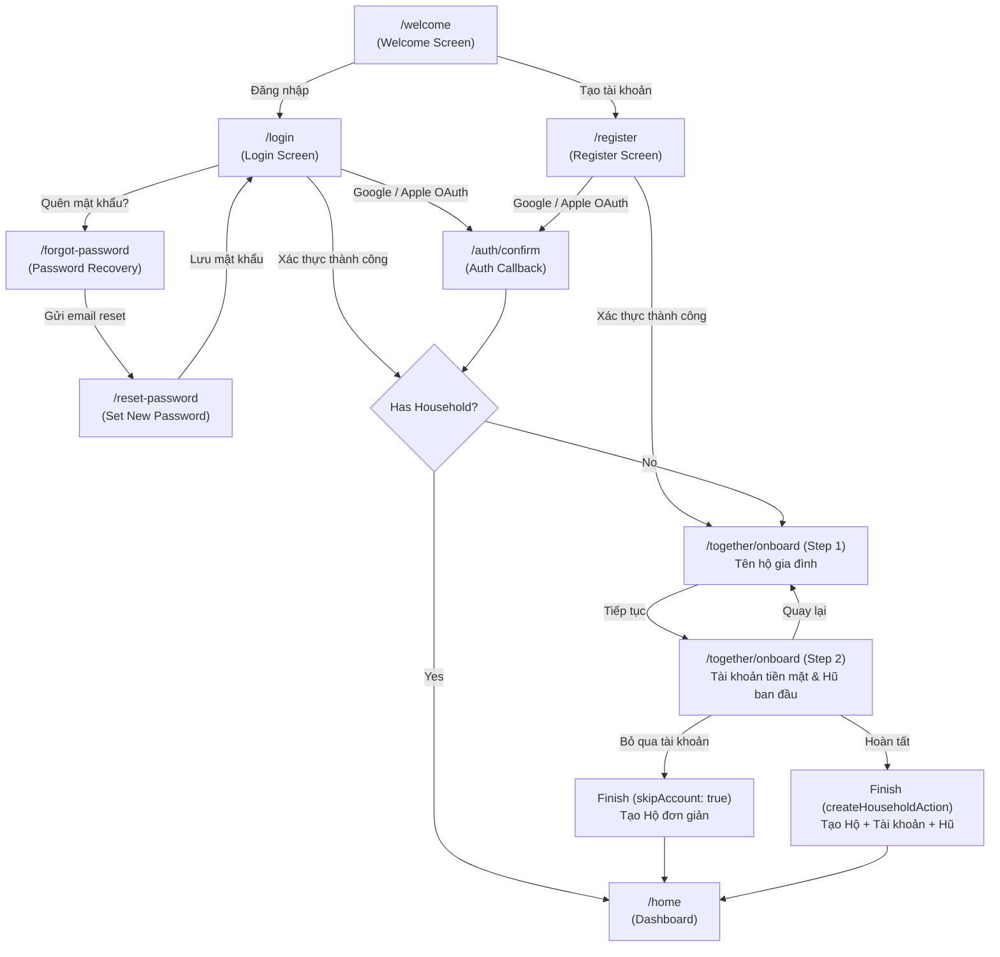

# Auth & Onboarding Experience Review

## 1. Executive Summary & Audit Baseline

This document reviews the complete unauthenticated entry experience and authenticated first-run onboarding flow of ViNha. The audit is derived directly from verified production code:

- `app/[locale]/(auth)`: `welcome-screen.tsx`, `login-screen.tsx`, `register-screen.tsx`, `forgot-password-screen.tsx`, `reset-password-screen.tsx`.
- `app/[locale]/(onboard)/together/onboard`: `onboard-wizard-screen.tsx`, `actions.ts`.
- `modules/tenancy`: `sign-in.schema.ts`, `register.schema.ts`, `create-household.schema.ts`, `oauth.schema.ts`, `auth-constants.ts`.
- `messages/vi`: `auth.json`, `onboard.json`.

---

## 2. Verified Entry Journey & Flow Map

---

## 3. Authentication Model & Supported Providers

ViNha supports exactly three verified authentication mechanisms:

1. **Google OAuth** (`OAuthProvider.GOOGLE`): Native browser redirect via Supabase Auth.
2. **Apple OAuth** (`OAuthProvider.APPLE`): Apple Sign-In native browser redirect.
3. **Email + Password**:
   - Email format validation via Zod (`z.string().email()`).
   - Password minimum length: **8 characters** (`PASSWORD_MIN_LENGTH = 8`).
   - Revealable password toggle (Show/Hide).
   - "Ghi nhớ đăng nhập" (Remember Me) checkbox storing email in `localStorage`.

_No invented authentication features_: ViNha does NOT require SMS OTP, phone verification, biometrics, magic links, or 2FA on initial registration.

---

## 4. Welcome Screen (`/welcome`)

- **Purpose**: Welcomes visitors, establishes ViNha's calm household proposition, quotes Home's hero card as a clear visual anchor, and offers two distinct entry buttons.
- **Top Bar**: Minimalist brand logo + `LocaleSwitcher` (VI / EN).
- **Core Headline**: _"Biết rõ tiền của nhà mình đi đâu"_ (Know where family money goes).
- **Subtitle**: _"Chi tiêu, kế hoạch và tiết kiệm của cả nhà — trong một nơi rõ ràng."_
- **3 Value Pillars**:
  1. _Thấy rõ tiền đi đâu_ (Icon: Chart bar).
  2. _Cùng nhau lên kế hoạch_ (Icon: User group).
  3. _Kiểm soát nhẹ nhàng, không rối_ (Icon: Savings).
- **Product Preview**: Static illustration card badged _"Xem trước"_, explicitly declaring: _"Số tiền thật hiện sau khi đăng nhập"_ to prevent confusion with actual user data.
- **CTA Hierarchy**:
  - Primary (Filled Teal): `Tạo tài khoản` (`/register`).
  - Secondary (Tonal Soft Teal): `Đăng nhập` (`/login`).

---

## 5. Login Screen (`/login`)

- **Top Bar**: Back button `<` routing to `/welcome`.
- **Title**: _"Chào mừng trở lại"_. Subtitle: _"Đăng nhập bằng email hoặc phương thức đã lưu."_
- **Social Buttons**:
  - `Tiếp tục với Google` (Google G logo, 44px height).
  - `Tiếp tục với Apple` (Apple logo, 44px height).
- **Divider**: _"hoặc tiếp tục với email"_.
- **Fields**:
  - `Email`: Text input with mail glyph, autocomplete `email`.
  - `Mật khẩu`: Revealable password field with lock glyph, show/hide eye toggle.
- **Remember & Recovery**:
  - Checkbox: _"Ghi nhớ đăng nhập"_.
  - Link: _"Quên mật khẩu?"_ (`/forgot-password`).
- **Submit CTA**: `Đăng nhập` (Primary button).
- **Footer**: _"Chưa có tài khoản? Tạo tài khoản"_ (`/register`).

---

## 6. Register Screen (`/register`)

- **Title**: _"Tạo tài khoản"_. Subtitle: _"Tạo tài khoản để quản lý tiền cùng hộ gia đình."_
- **Social Buttons**: Google and Apple OAuth triggers.
- **Divider**: _"hoặc tiếp tục với email"_.
- **Fields**:
  - `Email`: Text input.
  - `Mật khẩu`: Password field with helper text _"Ít nhất 8 ký tự"_.
  - `Xác nhận mật khẩu`: Confirm password field with real-time mismatch validation.
  - `Terms & Privacy`: Checkbox _"Tôi đồng ý với Điều khoản dịch vụ và Chính sách bảo mật"_.
- **Submit CTA**: `Tạo tài khoản` (Primary button).
- **Post-Registration State**:
  - If auto-confirmed: Redirects immediately to `/together/onboard`.
  - If email confirmation required: Surfaces clear alert card _"Kiểm tra email — Chúng tôi đã gửi liên kết xác nhận. Mở liên kết để hoàn tất tạo tài khoản."_

---

## 7. Password Recovery (`/forgot-password` & `/reset-password`)

### Forgot Password

- Back affordance: `< Quay lại đăng nhập`.
- Title: _"Quên mật khẩu"_. Subtitle: _"Nhập email để nhận liên kết đặt lại mật khẩu."_
- Field: `Email`.
- CTA: `Gửi liên kết` (Primary button).
- Success Feedback: Toast notification _"Đã gửi liên kết đặt lại mật khẩu. Kiểm tra email của bạn."_

### Reset Password

- Title: _"Tạo mật khẩu mới"_. Subtitle: _"Chọn một mật khẩu mới cho tài khoản của bạn."_
- Fields: `Mật khẩu mới` + `Xác nhận mật khẩu`.
- CTA: `Lưu mật khẩu mới`.
- Success: Redirects to `/home` or `/login`.

---

## 8. Onboarding Wizard (`/together/onboard`)

ViNha's authenticated onboarding wizard contains **exactly 2 steps** (`TOTAL_STEPS = 2`).

### Step 1: Đặt tên cho hộ gia đình (Household Name)

- **Progress**: _"Bước 1 / 2"_ (50% progress bar).
- **Title**: _"Đặt tên cho hộ gia đình"_.
- **Description**: _"Thiết lập không gian hộ gia đình để quản lý cùng nhau."_
- **Field**: `Tên hộ gia đình` (placeholder: _"ví dụ: Nhà mình"_).
- **Partners Awareness Card**: Info alert explaining:
  - Title: _"Bạn có thể bắt đầu một mình"_
  - Body: _"Sau khi thiết lập, bạn có thể mời thêm thành viên bất cứ lúc nào — không cần mời ngay."_
- **CTA**: `Tiếp tục` (Advances to Step 2).

### Step 2: Tài khoản tiền mặt và hũ ban đầu (Cash Account & Plan Preset)

- **Progress**: _"Bước 2 / 2"_ (100% progress bar).
- **Title**: _"Tài khoản tiền mặt và hũ ban đầu"_.
- **Description**: _"Tài khoản giữ tiền thật. Hũ là phong bì ý định cho kế hoạch chi tiêu và tiết kiệm, không phải số dư ngân hàng. Bạn có thể chỉnh sau."_
- **Section A: Tài khoản tiền mặt**:
  - `Tên tài khoản tiền mặt`: Defaults to _"Tiền mặt"_.
  - `Số tiền đã có trong tài khoản`: `AmountField` (VND tabular nums).
  - **P0 Critical Invariant**: _"Nhập số tiền đã có sẵn. Khoản này không được tính là thu nhập của tháng."_
- **Section B: Bố cục hũ ban đầu (`planPreset`)**:
  - `Cân bằng` (Balanced): _"Thiết yếu · Sinh hoạt · Dự phòng · Tiết kiệm"_ (with jar icon).
  - `Đơn giản` (Simple): _"Cần thiết · Mong muốn · Tiết kiệm"_ (with goal icon).
  - `Thiết lập sau` (Set up later): _"Thiết lập sẽ không tạo hũ nào."_ (dashed tile with info icon).
- **Action Hierarchy**:
  - Primary CTA: `Hoàn tất` (Creates household, cash account, opening balance, and jars -> redirects to `/home`).
  - Secondary Action: `Bỏ qua bước này` (Skips initial cash account and jars, creates bare household -> redirects to `/home`).
  - Tertiary Action: `Quay lại` (Returns to Step 1 preserving entered values).

---

## 9. P0 Financial Invariance: Opening Balance Semantics

- **The Law**: Money existing in an account before joining ViNha is an **Opening Balance** (Số dư ban đầu), NOT Monthly Income (Thu nhập trong tháng).
- **Implementation**: The onboarding server action calls `record_opening_balance` which establishes the initial ledger position without creating an income event.
- **Copy Safeguard**: The UI explicitly states: _"Khoản này không được tính là thu nhập của tháng"_, eliminating user anxiety about inflated monthly earnings.

---

## 10. Component Compliance (Task 11)

All Auth and Onboarding screens strictly adhere to the Task 11 Component System:

- **Buttons**: Primary 44px Teal, Tonal Soft Teal, Outlined 44px, Ghost text links.
- **Inputs**: 48px height, 10px radius, 1px hairline border, tabular numerals.
- **Password Input**: Standardized revealable text input with accessible eye toggle.
- **Selection**: `ChoiceTileGroup` and `ChoiceTile` with 10px radius and primary tinting.
- **Progress**: 6px progress bar primitive with clamped values.
- **Alerts**: Tonal `InlineAlert` with clear icons.

---

## 11. Responsive & Theme Parity

- **Responsive Viewports**: Validated at 360×800, 390×844, and 430×932.
- **Mobile Keyboard Compatibility**: Scrollable container ensures that submit CTAs and password toggle remain accessible when virtual keyboard is engaged.
- **Dark Mode Parity**: Exact 1-to-1 structure between Light (`#FAFAF9` canvas) and Dark (`#141416` canvas).
