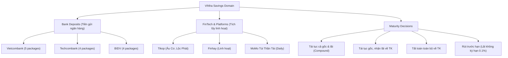

# Savings Experience Review

## Existing Savings Model

ViNha models savings deposits as committed, term-bound financial contracts distinctly separated from liquid checking balances (`modules/savings/application/savings-constants.ts`, `savings-types.ts`, `create-saving.schema.ts`).

A savings entity in ViNha contains:

- `principal` (Tiền gốc): The committed VND monetary deposit.
- `latestCycle` (Chu kỳ hiện tại):
  - `lockedRate` (Lãi suất cam kết): Annual percentage rate (%/năm) fixed for the cycle duration.
  - `startDate` (Ngày bắt đầu gửi): Start date in ISO format.
  - `endDate` (Ngày đáo hạn): Computed maturity date.
  - `accruedInterest` (Lãi tạm tính): Accrued interest to date based on the Vietnamese banking standard day-count convention (`actual/365`) and calculation method (`simple` or compound).
  - `status` (`CycleStatus`): `active`, `maturing_soon`, `mature_today`, `matured`, `settled`, `early_closed`, `rolled`.
- `productSnapshot` (Gói sản phẩm & Quy tắc):
  - `termAmount` & `termUnit` (Kỳ hạn: ví dụ 12 Tháng, 365 Ngày).
  - `interestCalculationMethod`: `simple` (standard for Vietnamese bank deposits), `compound_daily`, `compound_monthly`.
  - `earlySettlementRule`: `demand_interest` (hưởng lãi không kỳ hạn 0.1%/năm), `no_interest` (mất lãi), `fixed_penalty`.
- `provider`: Reference to bank or FinTech platform (`saving_providers`).
- `fundingAccountId`: Source account for new deposits (`null` for historical pre-existing savings).
- `settlementAccountId`: Destination checking account for principal and/or interest upon maturity.
- `settlementRule`: Rollover / Payout instruction (`roll_principal_interest`, `roll_principal_only`, `withdraw_everything`).
- `renewalPolicy`: Automation rule (`always_ask`, `auto_renew_until_cancelled`).

---

## Savings Status Model

The lifecycle of a savings contract moves through unambiguous states:

| Status Code     | Vietnamese Label | Visual Tone                           | Meaning                                                                                   | User Action                                                  |
| --------------- | ---------------- | ------------------------------------- | ----------------------------------------------------------------------------------------- | ------------------------------------------------------------ |
| `ACTIVE`        | Đang sinh lãi    | Emerald Soft (`#047857` / `#34D399`)  | Contract is actively accruing interest within its locked term.                            | View detail, configure renewal, or preview early withdrawal. |
| `MATURING_SOON` | Sắp đáo hạn      | Amber Soft (`#B45309` / `#FBBF24`)    | Remaining duration is $\le 7$ days. Escalated to Decision Inbox.                          | Review or confirm renewal rule before maturity day.          |
| `MATURE_TODAY`  | Đáo hạn hôm nay  | Amber High Contrast                   | Target maturity date reached today. Automatic or manual execution pending.                | Confirm settlement or approve rollover.                      |
| `MATURED`       | Đã đáo hạn       | Sky Blue Soft (`#0369A1` / `#38BDF8`) | Term ended; awaiting user settlement instruction if renewal policy was `always_ask`.      | Settle to checking account or open new cycle.                |
| `ROLLED`        | Đã tái tục       | Teal Soft (`#0F766E` / `#2DD4BF`)     | Contract completed a cycle and rolled into a new subsequent cycle.                        | View historical cycle ledger.                                |
| `SETTLED`       | Đã tất toán      | Neutral Slate (`#52525B` / `#A1A1AA`) | Full principal and final interest deposited into settlement account. Contract completed.  | Archived record.                                             |
| `EARLY_CLOSED`  | Rút trước hạn    | Rose / Amber Outline                  | Liquidated before maturity date; accrued interest forfeited or recalculated at 0.1%/year. | Settlement receipt stored in ledger.                         |

---

## Savings Overview

- **Route**: `/money/savings`
- **Screens**:
  - Light: `ba345835a5704c49a8dbe3499492724b`
  - Dark: `2a88b26d083b4bc9add1265deb372df0`
- **Responsibility & Architecture**:
  1. **Top App Bar**: Sticky navigation with 44×44px back touch target to `/money`, title _"Tiết kiệm & Tiền gửi"_, subtitle _"7 sổ tiết kiệm & tích lũy"_, utility entry to Provider Management (`/money/savings/providers`), and header CTA `+ Mở sổ mới`.
  2. **Top Portfolio Summary Hero**:
     - Large tabular readout of committed principal: **₫ 2.023.800.000** with privacy eye toggle.
     - Ring-fencing guardrail banner: _"Tiết kiệm có kỳ hạn là tài sản cam kết, tách biệt với tiền mặt sẵn sàng chi tiêu hàng ngày."_
     - 3-metric strip: Lãi dự kiến cả kỳ (**₫ 45.200.000**), Lãi suất bình quân (**6.45%/năm**), Sắp đáo hạn (**1 sổ trong 7 ngày**).
  3. **Near-Maturity Alert Card**: Highlights Techcombank Phát Lộc 12M (₫ 200.000.000) maturing in 3 days, showing current rollover instruction and quick CTA to _"Xem chi tiết"_.
  4. **Two-Tier Portfolio Organization**:
     - _Tiền gửi ngân hàng có kỳ hạn (4 sổ • ₫ 1.600.000.000)_: Vietcombank, Techcombank, BIDV with standardized 40×40px brand icon containers.
     - _Nền tảng tích lũy linh hoạt & FinTech (3 sổ • ₫ 423.800.000)_: Tikop, Finhay, MoMo Túi Thần Tài.
  5. **Provider Management Banner**: Direct entry point connecting 6 financial institutions.
  6. **Docked 5-Tab Navigation**: Canonical bottom bar with active indicator on _Tiền_.

---

## Create Savings

- **Route**: `/money/savings/new`
- **Screens**:
  - Light: `35876bf774334ecc8486799af0ecd117`
  - Dark: `7e097b34ab95493282d6fe0e93369f2d`
- **Wizard Structure**:
  - **Step 1 (Sản phẩm & Kỳ hạn)**: Select financial provider (Techcombank, Vietcombank, BIDV, Tikop, Finhay) and choose locked term package (1M, 3M, 6M, 12M, 24M).
  - **Step 2 (Số tiền & Nguồn)**: Enter principal (with VND currency mask and Vietnamese word pronunciation _"Năm mươi triệu đồng chẵn"_), configure funding account, settlement account, and start/maturity dates.
  - **Step 3 (Đáo hạn & Xác nhận)**: Select rollover instruction (`Tái tục cả gốc và lãi`, `Tái tục gốc nhận lãi`, `Tất toán toàn bộ`), set Decision Inbox reminder, and review expected yield breakdown (+₫ 3.400.000).

---

## Existing / In-Progress Savings

- **Domain Integrity Standard**: The wizard implements an explicit **Creation Mode Switcher**:
  - **Tab A — Gửi mới từ tài khoản (`LIVE_DEPOSIT`)**: Money is deducted immediately from the chosen checking account (`fundingAccountId`), creating an inter-account liquidity transfer.
  - **Tab B — Sổ đã có từ trước (`HISTORICAL_OPENING`)**: Used when recording a savings deposit created prior to using ViNha.
    - `fundingAccountId` is locked to `null`.
    - No checking account balance is deducted.
    - Original historical start date is entered (`startDate < todayIsoDate()`).
    - **Guaranteed P0 Law**: Does **NOT** create artificial income or expense records, preserving household historical cash flow integrity.

---

## Interest Rate UX

- **Interest Rate Precision**: Displayed explicitly as **% / năm** (`annualInterestRate`).
- **Calculation Formula**: Transparently annotated as `Phương pháp tính lãi đơn actual/365` (VND standard):
  $$\text{Tiền lãi} = \text{Tiền gốc} \times \frac{\text{Lãi suất (\%/năm)}}{100} \times \frac{\text{Số ngày thực tế}}{365}$$
- **Zero Ambiguity**: Never displays a floating number like `6.5` without units. Clearly communicates that monthly returns are derived from annual rates and not guaranteed monthly dividends.

---

## Term UX

- **Term Pairing**: Terms clearly display duration in days and months (e.g. `1M (30 ngày)`, `3M (90 ngày)`, `6M (180 ngày)`, `12M (365 ngày)`, `24M (730 ngày)`).
- **Automatic Date Derivation**: Instant calculation of `Ngày đáo hạn = Ngày bắt đầu + Kỳ hạn`, avoiding redundant manual date picker entry while allowing explicit date overrides when required by specific bank deposit contracts.

---

## Maturity UX

- **Time Remaining Visibility**: Displays remaining duration in exact days (e.g. _"Còn 132 ngày"_ or _"Còn 3 ngày"_).
- **Proactive Notification**: Automatically flags contracts with $\le 7$ days remaining with Amber warning styling and queues a triage item in `/inbox`.
- **Expected Maturity Value**: Clearly shows Total at Maturity ($\text{Gốc} + \text{Lãi dự kiến}$) without confusing it with current redeemable cash.

---

## Renewal UX

- **Rollover Instructions (`SettlementRule`)**:
  1. _Tái tục cả gốc và lãi_: Automatically rolls the full balance ($\text{Gốc} + \text{Lãi}$) into an identical subsequent term package, compounding returns.
  2. _Tái tục gốc, nhận lãi về tài khoản_: Rolls principal into a new term while depositing interest into the settlement checking account.
  3. _Không tái tục, tất toán toàn bộ về tài khoản_: Full liquidation into the household checking account upon maturity.
- **Decision Governance**: Integration with the Decision Inbox (`/inbox`). If the policy is `always_ask`, an actionable card is automatically queued 7 days before maturity to prevent accidental low-rate demand rollovers.

---

## Savings Detail

- **Route**: `/money/savings/:id`
- **Screens**:
  - Light: `5a287fda54be4ce7bfd54da4dddf98c4`
  - Dark: `1c27bb2764554f4c912da17bc700630e`
- **Information Architecture**:
  1. **Hero Identity**: Provider badge (Techcombank logo), contract code (`#TCB-2026-8842`), _"Chung ví"_ household ownership badge, large principal amount (**₫ 500.000.000**), active pulse status badge (_"Đang sinh lãi"_), and accrued interest so far (**+₫ 28.500.000**).
  2. **Timeline & Progress Track**: Start date (`15/03/2026`) vs Maturity (`15/03/2027`), remaining days counter (_"Còn 170 ngày"_), 53.4% elapsed progress bar, and expected tax-exempt maturity sum (**₫ 534.000.000**).
  3. **Renewal Policy Card**: Confirmed settlement instruction, linked destination account (`Vietcombank vợ ..4190`), and outline button _"Thay đổi thiết lập tái tục"_.
  4. **Utility Action Grid**:
     - _Rút trước hạn_ (Early withdrawal preview with warning).
     - _Sửa tái tục_ (Rollover policy editor).
     - _Lịch sử chu kỳ_ (Multi-cycle history).
  5. **Historical Ledger Feed**: Step-by-step transaction logs (Creation deposit, locked rate verification).
  6. **Safe Archive**: Separated bottom danger zone link.

---

## Provider Model

- **Entities**: Modeled via `saving_providers` table and `modules/savings/application/manage-savings-catalog.ts`.
- **System Providers (`is_system: true`)**: Vietcombank, Techcombank, BIDV, VPBank, Tikop, Finhay, MoMo. Standardized across all households, protected from accidental deletion.
- **Household Custom Providers**: Custom banks or specialized savings funds added by the family (e.g. Quỹ Tín dụng Nhân dân, Timo, Cake).
- **Institution Classification**: `BANK` (Ngân hàng thương mại) vs `PLATFORM` (Nền tảng FinTech / Ví điện tử).

---

## Provider Management

- **Route**: `/money/savings/providers`
- **Screens**:
  - Light: `e6045f74091f49b382bcbff36d2b72d8`
  - Dark: `8d9c799c6b33411aa1d07b139ff13906`
- **Features**:
  - Segregated lists: System Providers vs Household Custom Providers.
  - Active contract counts per institution (e.g. _3 sổ đang gửi_).
  - Benchmark interest rate ranges (e.g. _5.2% – 6.8%/năm_).
  - Quick action to add custom institutions.

---

## Add/Edit Provider

- **Route**: `/money/savings/providers/new`
- **Screens**:
  - Light: `763f018d45d6484f9ec9deb0a1920003`
  - Dark: `829c85e862114794ae941d05c3457353`
- **Modal Architecture**:
  - Accessible half-sheet drawer with drag handle.
  - Institution Name input with autofocus.
  - Category selector chips (`Ngân hàng thương mại`, `Nền tảng FinTech`, `Khác / Quỹ tín dụng`).
  - Brand color & icon picker (`bank`, `wallet`, `smartphone`, `vault`).
  - **Archive Integrity Notice**: Custom providers cannot be hard-deleted if active savings contracts reference them; they are soft-archived (`is_active: false`), preserving historical audit trails.

---

## Financial Semantics

- **Tiền gốc $\ne$ Tiền lãi**: Clear textual and typographic separation between committed principal (32px bold) and accrued/expected interest (emerald token).
- **Lãi suất $\ne$ Số tiền lãi**: Annual percentage (%/năm) is explicitly separated from VND monetary yields.
- **Khoản tiết kiệm $\ne$ Tiền thanh toán**: Term deposits are strictly ring-fenced; they do not appear as ready-to-spend cash balances in daily budget tools.
- **Sổ tiết kiệm đã có $\ne$ Thu nhập mới**: Historical opening mode adds historical assets without polluting current-month income or spending metrics.
- **Đáo hạn $\ne$ Tất toán sớm**: Early withdrawal explicitly warns of interest forfeiture (reduced to non-term rate 0.1%/năm).
- **Nhà cung cấp $\ne$ Tài khoản ngân hàng**: Clear boundary between financial institutions offering savings products and household liquid checking accounts.

---

## UI Consistency

All 10 canonical screens conform strictly to the **ViNha Warm Precision** design tokens:

- **Geometry**: 440px centered frame, 12px card radii, 10px control radii, 40×40px icon containers.
- **Typography**: Geist font with `tabular-nums` for all numbers.
- **Iconography**: 100% native inline SVGs with standard 1.8px round strokes. Zero external icon fonts or emoji.
- **Light/Dark Parity**: Exact 1-to-1 component tree and spatial hierarchy across light and dark canonical pairs.

---

## Visual QA

- **Icon Standard**: All peer icons use identical 40×40px badge wrappers with 1.8px stroke width.
- **Status Pills**: Configured with `whitespace-nowrap shrink-0` to eliminate awkward text wrapping.
- **Touch Targets**: All interactive elements satisfy minimum 44×44px touch targets.
- **Spacing**: Strict 8pt grid with 16px horizontal screen gutters.

---

## Responsive Review

Validated at:

- `360 × 800` (Small Android): Zero horizontal scroll, tabular numbers fit comfortably within cards.
- `390 × 844` (iPhone 14/15): Optimal balanced layout with comfortable margins.
- `430 × 932` (iPhone Pro Max): Clean centered column presentation without layout stretching.

---

## Accessibility

- **WCAG AA Compliance**: High-contrast text ratios ($\ge 4.5:1$ for body text, $\ge 3:1$ for large numbers).
- **Non-Color Indicators**: All statuses pair semantic color with explicit textual badges and icon indicators.
- **Focus Rings**: Standardized 2px Teal focus outlines on interactive form inputs.

---

## Light Theme

- Canvas: Warm Linen `#FBFBF9`
- Cards: Pure White `#FFFFFF` with `#E4E4E7` borders
- Text: Deep Charcoal `#18181B`
- Accents: Mint Teal `#0F766E`, Emerald `#047857`, Amber `#B45309`

---

## Dark Theme

- Canvas: Slate Charcoal `#141416`
- Cards: Dark Surface `#1C1C1F` with `#2E2E33` borders
- Text: Crisp White `#F4F4F5`
- Accents: Bright Teal `#2DD4BF`, Bright Emerald `#34D399`, Warm Amber `#FBBF24`

---

## Prototype

- `Money → Savings`: Seamless navigation from `/money` savings domain row to `/money/savings`.
- `Savings → Add Savings → Detail`: Complete 3-step wizard with dual-mode creation leading to active contract detail.
- `Savings → Provider Management → Add Provider`: Modal sheet drawer for creating custom savings institutions.

---

## Deferred Issues

- **Investments Domain**: Untouched (remains out of scope).
- **Loans & Mortgages Domain**: Untouched (remains out of scope).
- **Personal Lending / Borrowing**: Untouched (remains out of scope).
- **Production Code Implementation**: No modifications made to Next.js or Supabase code. All designs live canonically in Google Stitch project `16826760243481546078`.
