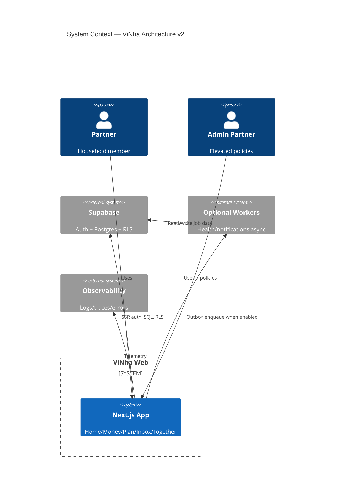

# Architecture v2

## Status

**OFFICIAL IMPLEMENTATION BLUEPRINT** — Architecture Definition `v2.0.0`  
Selected: **Candidate B — Balanced (modified)** per Architecture Decision freeze.

## System Context

*(If C4 renderer unavailable, see textual context below.)*

### Textual system context

- **Users:** Partners / Admin partners  
- **System:** Single Next.js deployable (web)  
- **External:** Supabase (Auth, Postgres, RLS); optional managed workers; observability vendors  
- **Out of scope runtime:** `ai-os/` control plane  

## Runtime shape

One web deployable + managed DB/auth. Application services per BC. UI Adapters (RSC/Actions) and API Facade (`/api/v1`) both call services. Optional workers consume outbox for Health/notifications.

## Product alignment

IA surfaces map to modules: Together/Auth→tenancy; Money→ledger; Plan→plan; Inbox→inbox; Health→health; Home composes queries across services without owning domain writes.
