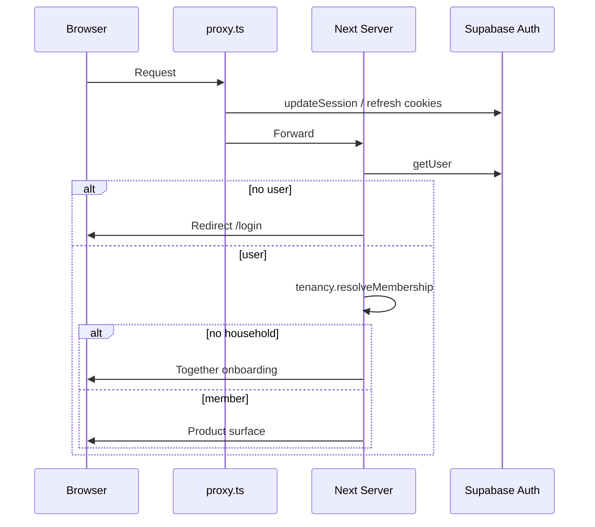

# Authentication Flow

```mermaid
sequenceDiagram
  participant B as Browser
  participant P as proxy.ts
  participant N as Next Server
  participant S as Supabase Auth
  B->>P: Request
  P->>S: updateSession / refresh cookies
  P->>N: Forward
  N->>S: getUser
  alt no user
    N->>B: Redirect /login
  else user
    N->>N: tenancy.resolveMembership
    alt no household
      N->>B: Together onboarding
    else member
      N->>B: Product surface
    end
  end
```
