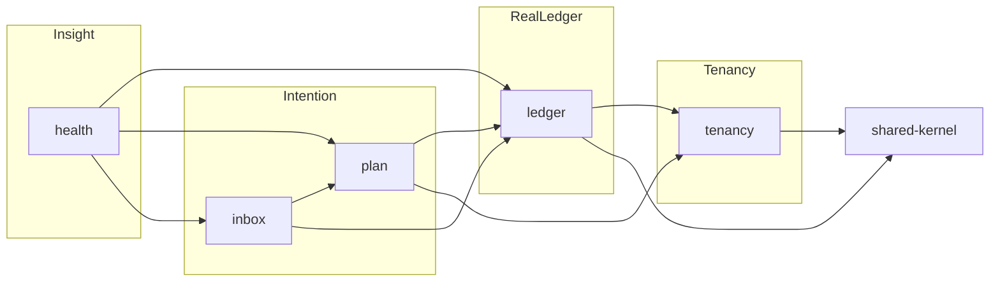

# Bounded Context Diagram

## Context map

| Upstream | Downstream | Relation |
|----------|------------|----------|
| tenancy | ledger, plan, inbox, health | Customer/Supplier — membership required |
| ledger | plan, inbox, health | Conformist on Account/Transaction IDs; plan must not write ledger balances via jar math |
| plan | inbox | Publisher of ReviewItems |
| ledger+plan+inbox | health | Open-host service queries / read models |

## Invariant

**BR-01:** Plan/Inbox never present jar totals as ledger balances.
