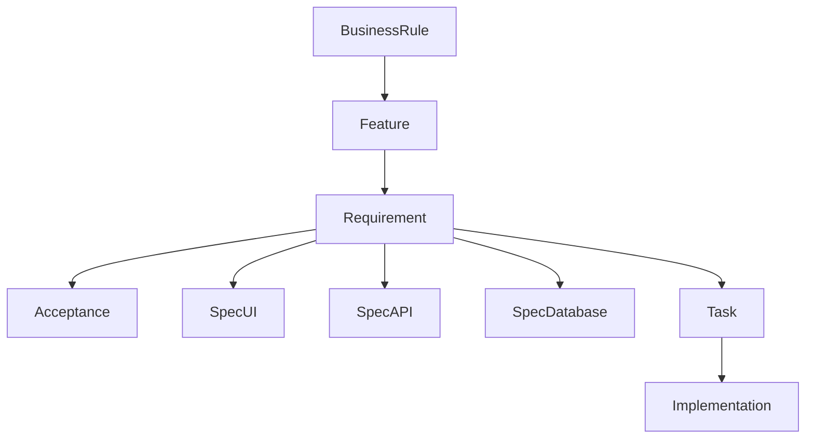

# Specification Knowledge Graph

**Run:** `run_spec_evolution_20260801T134000Z`  
**Created:** 2026-08-01T13:39:19Z  
**Nodes:** 292 · **Edges:** 1547  
**Constraint:** Original specifications are read-only. This graph is derived.

## Type counts

| Type | Count |
|------|------:|
| Acceptance | 14 |
| Architecture | 10 |
| BusinessRule | 14 |
| DomainEntity | 15 |
| Domain_bounded-context | 3 |
| Feature | 18 |
| Implementation | 9 |
| Journey | 6 |
| Knowledge | 6 |
| Permission | 10 |
| RepoNote | 17 |
| Requirement | 42 |
| RoadmapItem | 4 |
| SpecAPI | 18 |
| SpecArchitecture | 3 |
| SpecCoding | 4 |
| SpecDatabase | 26 |
| SpecDeployment | 2 |
| SpecFunctional | 25 |
| SpecProduct | 3 |
| SpecSecurity | 10 |
| SpecTechnical | 1 |
| SpecUI | 3 |
| StateMachine | 11 |
| Task | 10 |
| Workflow | 8 |

## Layered chain (canonical)

## Business rules (preserved 100%)

- `br-action-context`: Server actions require authenticated user and active household_members row via resolveActionContext.
- `br-amount-positive`: Movement amounts must be positive; balanceDelta ∈ {-1,0,1}.
- `br-assumptions-admin`: Household planning assumptions (inflation, growth rates) are admin-only updates in settings actions.
- `br-closed-month`: Approved month close (jar_month_close_runs.status=approved) blocks normal movements; corrections use
- `br-expense-allocate`: Expense allocation uses jar_category_rules/jar_rules; auto if mapped and expense_auto_allocate!=off,
- `br-income-allocate`: Income allocation uses month plans (percent|fixed) then suggest/auto per income_auto_allocate policy
- `br-installment-complete`: Installment plans complete when paid_installments >= num_installments.
- `br-jar-active`: Movements require an active jar (not archived / not soft-deleted).
- `br-month-close-mode`: month_close_mode is manual|assisted.
- `br-one-household`: create_household_with_owner enforces one active household per user.
- `br-overspend-policy`: Household overspend_policy is warn|block|allow_negative.
- `br-real-vs-virtual`: Jar movements must not be treated as real ledger mutations; real money lives in accounts/transaction
- `br-rls-member`: RLS grants household-scoped CRUD via is_household_member(household_id) for most product tables.
- `br-savings-maturity`: Savings maturity actions renew_same|switch_plan|withdraw; withdraw modes partial|full; terminal stat

## Graph files

- `graph.json`
- `traceability-matrix.json`
- `freeze-manifest.json`

## Attestation

- No original BD/SPEC/REPO/final payloads modified.
- No business rules removed.
- No new business requirements invented in this graph.
