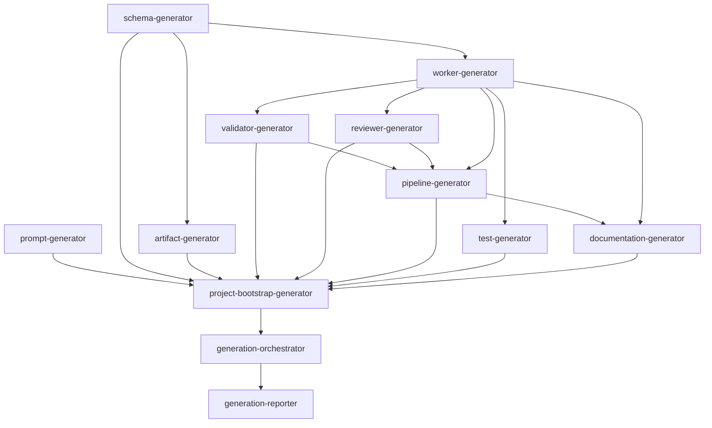

# Execution Graph (v0.9.1)

```mermaid
flowchart TD
  SG[schema-generator] --> AG[artifact-generator]
  SG --> WG[worker-generator]
  PG[prompt-generator] --> BS[project-bootstrap-generator]
  SG --> BS
  WG --> VG[validator-generator]
  WG --> RG[reviewer-generator]
  VG --> PL[pipeline-generator]
  RG --> PL
  WG --> PL
  WG --> TG[test-generator]
  PL --> DG[documentation-generator]
  WG --> DG
  AG --> BS
  VG --> BS
  RG --> BS
  PL --> BS
  TG --> BS
  DG --> BS
  BS --> GO[generation-orchestrator]
  GO --> GR[generation-reporter]
```

Waves are topologically valid — no hard edge within the same wave.
