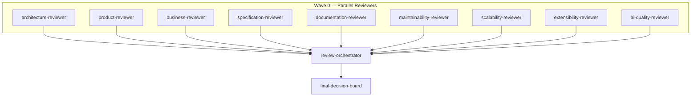

# Review Engine — Execution Graph

```mermaid
flowchart TB
  subgraph W0["Wave 0 — Parallel Reviewers"]
    AR[architecture-reviewer]
    PR[product-reviewer]
    BR[business-reviewer]
    SR[specification-reviewer]
    DR[documentation-reviewer]
    MR[maintainability-reviewer]
    SCR[scalability-reviewer]
    ER[extensibility-reviewer]
    AI[ai-quality-reviewer]
  end
  RO[review-orchestrator]
  FDB[final-decision-board]
  AR & PR & BR & SR & DR & MR & SCR & ER & AI --> RO
  RO --> FDB
```

Packaging milestone: **reviews not executed**.
