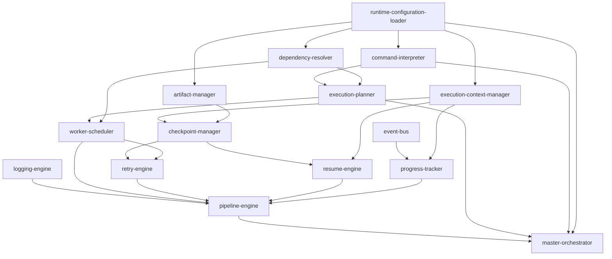

# Execution Graph

```mermaid
flowchart TD
  RCL[runtime-configuration-loader] --> CI[command-interpreter]
  RCL --> DR[dependency-resolver]
  RCL --> ECM[execution-context-manager]
  RCL --> AM[artifact-manager]
  EB[event-bus] --> PT[progress-tracker]
  LE[logging-engine] --> PE[pipeline-engine]
  CI --> EP[execution-planner]
  DR --> EP
  ECM --> CM[checkpoint-manager]
  AM --> CM
  ECM --> PT
  EP --> WS[worker-scheduler]
  DR --> WS
  CM --> RE[retry-engine]
  WS --> RE
  CM --> RSE[resume-engine]
  ECM --> RSE
  WS --> PE
  RE --> PE
  RSE --> PE
  PT --> PE
  PE --> MO[master-orchestrator]
  EP --> MO
  CI --> MO
  RCL --> MO
```

Waves are topologically valid — no hard edge within the same wave.
