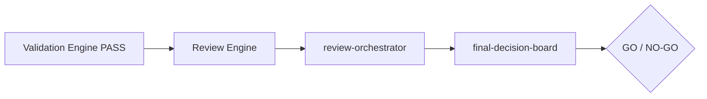

# Governance Decision Record (human mirror)

Machine source: `governance-decision` JSON.

## Sections

1. Summary
2. Critical risks
3. Overall recommendation
4. Improvement plan
5. Go / no-go
6. Release recommendation
7. Final decision

## Mermaid

