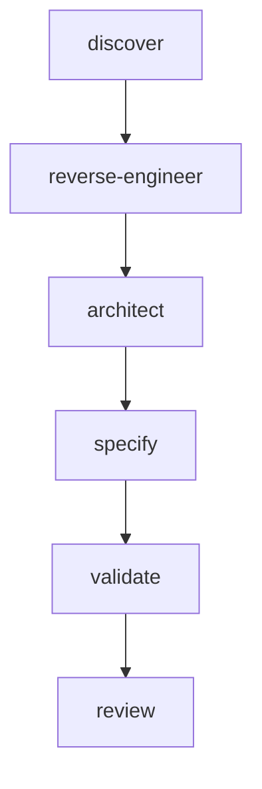

# AI Framework Refactoring Board Report

**Version:** 0.12.0  
**Date:** 2026-08-01  
**Stance:** Zero attachment. Legacy software. Justify or remove.

## Board

Principal Software Architect · AI Platform Architect · Staff Runtime Engineer · Senior Product Engineer · Principal Software Engineer · Platform Tech Lead

## Executive Summary

AIOS grew to **81 workers**, **9 pipelines**, **~1700 directories**, **~3700 files**, and **~970 markdown docs**. Capabilities are real and must be preserved, but the **cognitive model is worker-scaled**, not capability-scaled.

**Applied in v0.12.0 (safe):**

1. Introduce **Capability Layer** (8 + 1 optional) as primary DX / `@Run` model
2. Document **MERGE/GENERALIZE** targets for validate / review / qualify / runtime
3. **MOVE** Framework Generator (`scaffold`) off `@Run full` critical path
4. **DELETE** duplicate runtime config copies + accidental `Untitled/` stub
5. Rewrite entry docs (`AGENTS.md`, simplified architecture) around capabilities

**Deferred (unsafe without execution adapters):** physical deletion/merge of registered workers — would break packaging registration smokes and destroy BC for Sprint 0–11 artifacts.

## Current Architecture

| Engine | Pipeline | Workers (approx) |
|--------|----------|------------------|
| Discovery | `discovery` | 6 |
| Product RE | `product-re` | 9 |
| Solution Architecture | `solution-architecture` | 4 |
| Specification Engineering | `specification-engineering` | 4 |
| Validation | `validation-engine` | 10 |
| Review | `review-engine` | 11 |
| Framework Generator | `framework-generator` | 12 |
| Qualification | `qualification-framework` | 10 |
| Runtime | `runtime-engine` | 15 |

Plus Core Engine (`ai-os/core`), registries, schemas, produce packs.

## Problems

1. **Worker explosion** — 81 peers with near-clone SKILL shells in generator/qualification/runtime waves
2. **Parallel taxonomies** — pipelines vs produce folders vs engines vs gates all name the same ideas differently
3. **Runtime micro-workers** — 15 orchestration workers for what is 4 subsystems
4. **Validation/Review micro-workers** — rule packs modeled as separate packages
5. **Meta on critical path** — Framework Generator sits beside RE as if required for `@Run full`
6. **Doc surface** — ~970 MD files; many partition READMEs are empty shells
7. **Config duplication** — `core/packages/configs/runtime/` mirrored `runtime/configs/`
8. **Token cost** — agents load worker forests instead of capability maps

## Decisions (capability level)

| Capability | Decision | Rationale |
|------------|----------|-----------|
| discover | KEEP | Distinct lifecycle; low duplication |
| reverse-engineer | KEEP | Required capability |
| architect | KEEP | Required capability |
| specify | KEEP | Required capability |
| validate | GENERALIZE | 7 validators → rule packs + orchestrator/reporter |
| review | GENERALIZE | 9 reviewers → rubrics + orchestrator/board |
| qualify | MERGE | evaluation+metrics+coverage; stress+regression |
| runtime | MERGE | 15 → 4 subsystems |
| scaffold | MOVE | Optional meta; not required for RE/Spec/Validate/Review |

## Delete List (applied vs deferred)

### Applied

- Untitled/ (accidental nested .git stub — not part of AIOS)
- core/packages/configs/runtime/.ai-os.yaml (duplicate of runtime/configs/)
- core/packages/configs/runtime/* duplicated YAML (replaced with pointer README)

### Deferred (cannot safely delete without adapters)

- Individual validation workers (`artifact-validator` … `consistency-validator`) — **GENERALIZE later**
- Individual review workers (`*-reviewer` except orchestrator/board) — **GENERALIZE later**
- Runtime micro-workers (event-bus, logging-engine, checkpoint/retry/resume split, etc.) — **MERGE later**
- Qualification micro-workers — **MERGE later**
- Framework Generator workers — **KEEP packages**, MOVE off critical path only
- Produce-pack TEMPLATE.md shells — needed as partition markers for existing contracts

## Merge Plan

| Merge into | Sources | When safe |
|------------|---------|-----------|
| `validation-ruleset` | 7 validators | After rule-pack schema + one executor |
| `review-rubric-runner` | 9 reviewers | After shared rubric runner |
| `runtime-observability` | event-bus + logging-engine | After event/log unified schema |
| `runtime-resilience` | checkpoint + retry + resume | After single state machine |
| `runtime-state` | context + progress + artifact-manager | After unified state store |
| `quality-metrics` | evaluation + metrics + coverage | After shared scorecard |
| `resilience-bench` | stress + regression | After shared bench harness |

## Split Plan

| Component | Split? | Why |
|-----------|--------|-----|
| `master-orchestrator` | NO | Already SRP as UX entry |
| `final-decision-board` | NO | Governance boundary clear |
| Core `orchestrator` vs Runtime `master-orchestrator` | RENAME later | Naming collision — Core stays control-plane; Runtime is product UX |

## Rename Plan (deferred physical)

| Current | Proposed | Why |
|---------|----------|-----|
| `framework-generator` pipeline | `scaffold` | Matches optional capability |
| Core module `orchestrator` | `task-orchestrator` | Disambiguate from Master Orchestrator |
| Produce `docs/architecture/` consume alias | keep → `artifacts/product-architecture/` | Already documented; enforce in DX |

## Simplification Plan

1. **Now:** Capability registry + `@Run` maps to capability order  
2. **Next:** Adapter that expands capability → worker list at runtime (no user-facing worker ids)  
3. **Then:** Physically merge micro-workers behind adapters; shrink registry  
4. **Finally:** Delete obsolete worker packages + update smokes  

## New Runtime Design

```
@Run <cmd>
  → command-interpreter (capability intent)
  → execution-planner (capability graph)
  → master-orchestrator
  → for capability in order:
       pipeline-engine.run(capability.pipeline)
       checkpoint
  → execution-summary
```

Users never select workers.

## New Pipeline (logical `@Run full`)



`@Run benchmark` → `qualify` only  
`@Run validate` / `@Run review` → single capability  
`@Run resume` / `@Run retry` → runtime resilience  

## New Dependency Graph

Capability edges only (above). Worker graphs remain internal to each pipeline until physical merge.

## Migration Strategy

1. v0.12.0 — Capability layer + docs (this release)  
2. v0.13.x — Runtime expands capabilities → workers (transparent)  
3. v0.14.x — Merge validate/review micro-workers behind one package each  
4. v0.15.x — Merge runtime 15 → 4; delete obsolete ids from registry  

## Backward Compatibility Plan

- All worker ids, pipeline ids, schemas remain valid  
- Smokes unchanged except VERSION + capabilities presence  
- `scaffold` / `framework-generator` still registered  
- Produce pack paths unchanged  

## Risk Assessment

| Risk | Level | Mitigation |
|------|-------|------------|
| Physical worker deletion breaks smokes | High | Deferred |
| Dual models (capability + worker) confuse agents | Medium | AGENTS.md leads with capabilities |
| Framework Generator users expect critical-path status | Low | Documented as optional scaffold |

## Implementation Order

1. Capability registry + simplified architecture (done)  
2. Config dedupe + junk delete (done)  
3. AGENTS / contracts / release notes (done)  
4. Runtime command registry references capabilities (done)  
5. Future: runtime adapter + physical merges  

## Per-worker decision index

| Worker | Capability | Decision |
|--------|------------|----------|
| `discover-repo-map` | `discover` | KEEP (capability-level) |
| `discover-domain-map` | `discover` | KEEP (capability-level) |
| `discover-contract-inventory` | `discover` | KEEP (capability-level) |
| `discover-registry-audit` | `discover` | KEEP (capability-level) |
| `discover-runtime-surface` | `discover` | KEEP (capability-level) |
| `discover-gap-report` | `discover` | KEEP (capability-level) |
| `product-knowledge-ingest` | `reverse-engineer` | KEEP (capability-level) |
| `feature-surface-inventory` | `reverse-engineer` | KEEP (capability-level) |
| `business-rules-extractor` | `reverse-engineer` | KEEP (capability-level) |
| `product-architecture-observer` | `reverse-engineer` | KEEP (capability-level) |
| `product-analyst` | `reverse-engineer` | KEEP (capability-level) |
| `workflow-analyzer` | `reverse-engineer` | KEEP (capability-level) |
| `requirement-generator` | `reverse-engineer` | KEEP (capability-level) |
| `acceptance-criteria-generator` | `reverse-engineer` | KEEP (capability-level) |
| `product-re-gap-report` | `reverse-engineer` | KEEP (capability-level) |
| `architecture-consultant` | `architect` | KEEP (capability-level) |
| `tech-stack-consultant` | `architect` | KEEP (capability-level) |
| `refactoring-consultant` | `architect` | KEEP (capability-level) |
| `folder-structure-designer` | `architect` | KEEP (capability-level) |
| `specification-generator` | `specify` | KEEP (capability-level) |
| `task-generator` | `specify` | KEEP (capability-level) |
| `roadmap-generator` | `specify` | KEEP (capability-level) |
| `implementation-planner` | `specify` | KEEP (capability-level) |
| `artifact-validator` | `validate` | GENERALIZE (capability-level) |
| `schema-validator` | `validate` | GENERALIZE (capability-level) |
| `dependency-validator` | `validate` | GENERALIZE (capability-level) |
| `pipeline-validator` | `validate` | GENERALIZE (capability-level) |
| `traceability-validator` | `validate` | GENERALIZE (capability-level) |
| `completeness-validator` | `validate` | GENERALIZE (capability-level) |
| `consistency-validator` | `validate` | GENERALIZE (capability-level) |
| `quality-scoring-engine` | `validate` | GENERALIZE (capability-level) |
| `validation-orchestrator` | `validate` | GENERALIZE (capability-level) |
| `validation-reporter` | `validate` | GENERALIZE (capability-level) |
| `architecture-reviewer` | `review` | GENERALIZE (capability-level) |
| `product-reviewer` | `review` | GENERALIZE (capability-level) |
| `business-reviewer` | `review` | GENERALIZE (capability-level) |
| `specification-reviewer` | `review` | GENERALIZE (capability-level) |
| `documentation-reviewer` | `review` | GENERALIZE (capability-level) |
| `maintainability-reviewer` | `review` | GENERALIZE (capability-level) |
| `scalability-reviewer` | `review` | GENERALIZE (capability-level) |
| `extensibility-reviewer` | `review` | GENERALIZE (capability-level) |
| `ai-quality-reviewer` | `review` | GENERALIZE (capability-level) |
| `review-orchestrator` | `review` | GENERALIZE (capability-level) |
| `final-decision-board` | `review` | GENERALIZE (capability-level) |
| `reference-project-catalog` | `qualify` | MERGE (capability-level) |
| `benchmark-runner` | `qualify` | MERGE (capability-level) |
| `qualification-runner` | `qualify` | MERGE (capability-level) |
| `evaluation-engine` | `qualify` | MERGE (capability-level) |
| `stress-test-runner` | `qualify` | MERGE (capability-level) |
| `metrics-engine` | `qualify` | MERGE (capability-level) |
| `coverage-analyzer` | `qualify` | MERGE (capability-level) |
| `regression-runner` | `qualify` | MERGE (capability-level) |
| `certification-engine` | `qualify` | MERGE (capability-level) |
| `release-qualification-board` | `qualify` | MERGE (capability-level) |
| `runtime-configuration-loader` | `runtime` | MERGE (capability-level) |
| `event-bus` | `runtime` | MERGE (capability-level) |
| `logging-engine` | `runtime` | MERGE (capability-level) |
| `command-interpreter` | `runtime` | MERGE (capability-level) |
| `dependency-resolver` | `runtime` | MERGE (capability-level) |
| `execution-context-manager` | `runtime` | MERGE (capability-level) |
| `artifact-manager` | `runtime` | MERGE (capability-level) |
| `execution-planner` | `runtime` | MERGE (capability-level) |
| `checkpoint-manager` | `runtime` | MERGE (capability-level) |
| `progress-tracker` | `runtime` | MERGE (capability-level) |
| `worker-scheduler` | `runtime` | MERGE (capability-level) |
| `retry-engine` | `runtime` | MERGE (capability-level) |
| `resume-engine` | `runtime` | MERGE (capability-level) |
| `pipeline-engine` | `runtime` | MERGE (capability-level) |
| `master-orchestrator` | `runtime` | MERGE (capability-level) |
| `schema-generator` | `scaffold` | MOVE (optional meta) |
| `artifact-generator` | `scaffold` | MOVE (optional meta) |
| `prompt-generator` | `scaffold` | MOVE (optional meta) |
| `worker-generator` | `scaffold` | MOVE (optional meta) |
| `validator-generator` | `scaffold` | MOVE (optional meta) |
| `reviewer-generator` | `scaffold` | MOVE (optional meta) |
| `pipeline-generator` | `scaffold` | MOVE (optional meta) |
| `test-generator` | `scaffold` | MOVE (optional meta) |
| `documentation-generator` | `scaffold` | MOVE (optional meta) |
| `project-bootstrap-generator` | `scaffold` | MOVE (optional meta) |
| `generation-orchestrator` | `scaffold` | MOVE (optional meta) |
| `generation-reporter` | `scaffold` | MOVE (optional meta) |

## Gate packages

| Package | Decision |
|---------|----------|
| `*-schema-check` (9) | GENERALIZE later → one parameterized gate |
| `*-coverage-review` (9) | GENERALIZE later → one parameterized rubric |

## Folder decisions

| Folder | Decision |
|--------|----------|
| `docs/capabilities/` | CREATE (primary DX) |
| `runtime/` | KEEP (execution root) |
| `core/packages/workers/` | KEEP (implementation; shrink later) |
| `core/packages/scaffold/` | MOVE (optional meta) |
| `governance/qualification/` | KEEP |
| `Untitled/` | DELETE |
| `core/packages/configs/runtime/*.yaml` | DELETE duplicates |
| Produce packs (`artifacts/features/`, `artifacts/validation/`, …) | KEEP |
| `docs/architecture/` | KEEP + add simplified docs |

## Success criteria check

| Criterion | v0.12.0 status |
|-----------|----------------|
| Fewer components (cognitive) | YES — 8 capabilities vs 81 workers |
| Fewer components (physical workers) | DEFERRED — unsafe |
| Lower complexity for users | YES — `@Run` + capabilities |
| Preserve RE/Spec/Validate/Review/Runtime/Qualify | YES |
| Easier onboarding | YES — SIMPLIFIED_ARCHITECTURE + capabilities README |
