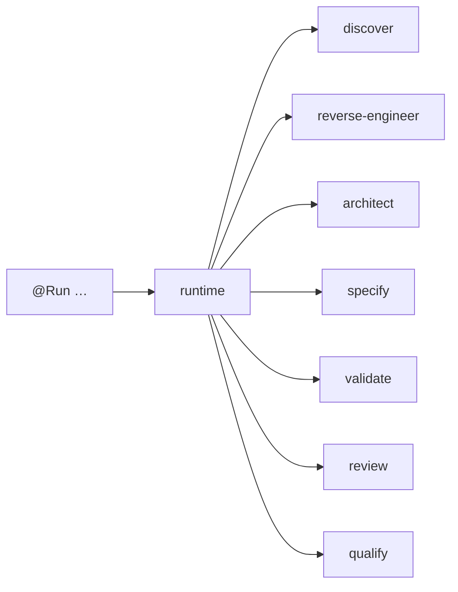

# AIOS Simplified Architecture (v0.12.0)

## Mental model (8 capabilities)



| Layer | Responsibility | User command |
|-------|----------------|--------------|
| **runtime** | Orchestrate only | all `@Run` |
| **discover** | Repo/contract map | `@Run full` |
| **reverse-engineer** | Product knowledge | `@Run full` / `incremental` |
| **architect** | Solution redesign | `@Run full` |
| **specify** | Specs / tasks / roadmap | `@Run full` |
| **validate** | Deterministic gates | `@Run validate` |
| **review** | Qualitative governance | `@Run review` |
| **qualify** | Certify / benchmark | `@Run benchmark` |

Optional: **scaffold** (`framework-generator`) — meta tooling, not on `@Run full`.

## Target folder structure (logical)

```
ai-os/
  docs/capabilities/          # primary DX model
  runtime/               # execution
  core/packages/pipelines/             # capability bindings
  core/packages/workers/               # implementation details (BC)
  core/packages/contracts/             # normative invariants
  core/packages/schemas/               # shared contracts
  core/packages/registry/              # indexes
  docs/architecture/          # control-plane docs
  core/packages/templates/             # scaffolds
  <produce packs>/       # domain outputs (features, validation, reviews, …)
```

## What end users need

1. `runtime/configs/.ai-os.yaml`
2. One command: `@Run full`
3. Artifacts under declared produce packs

They do **not** need to know 81 worker ids.
