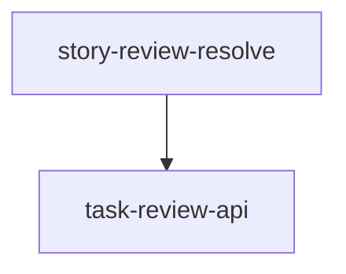

# implementation — Implementation Plan (mirror)

> Produce folder for **implementation-plan**. Owns build-order / critical path (RACI).

**Runtime kinds:** build-order, critical-path, parallel-work, blocked, graph-node, graph-edge.

## Required (ready)

| Kind | Notes |
|------|-------|
| build-order | ≥1 |
| critical-path | ≥1 |
| parallel-work or blocked | ≥1 |

## Mermaid

`graph-edge` statements may embed Mermaid fenced graphs, e.g.:

## Rules

- Respect `tasks/` depends_on and `roadmap/` delivery-order.
- Do not invent modules or redesign architecture-v2.

## Entries

| id | entry_kind | critical_path | depends_on | sources | confidence | unknowns |
|----|------------|---------------|------------|---------|------------|----------|
| | | | | | | |
