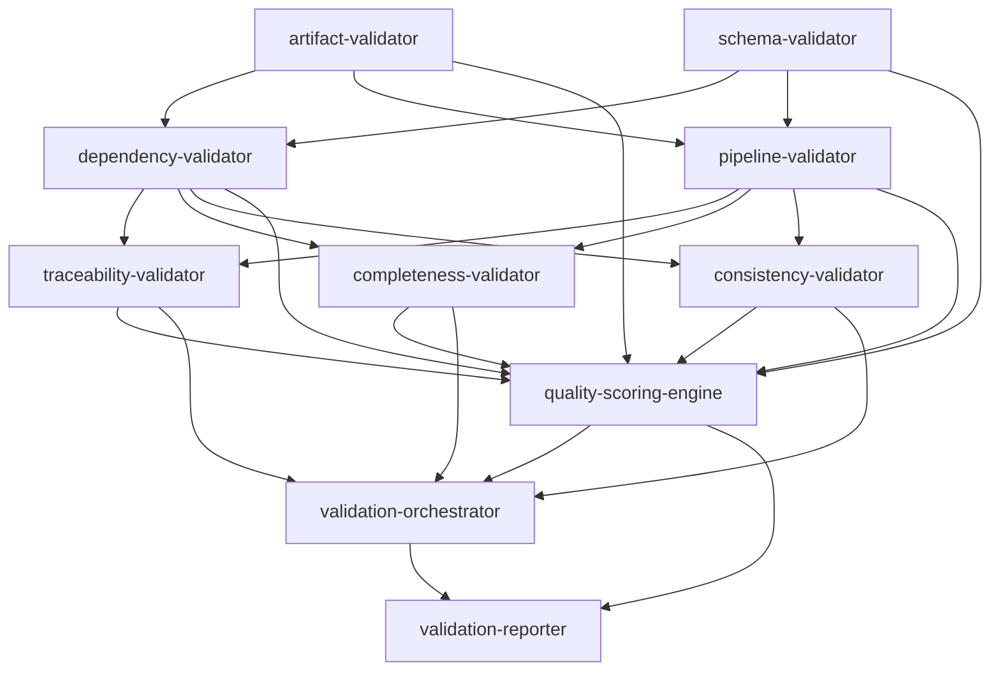

# Validation Engine — Execution Graph

```mermaid
flowchart TB
  A[artifact-validator] --> D[dependency-validator]
  S[schema-validator] --> D
  A --> P[pipeline-validator]
  S --> P
  D --> T[traceability-validator]
  D --> C[completeness-validator]
  D --> X[consistency-validator]
  P --> T
  P --> C
  P --> X
  T --> Q[quality-scoring-engine]
  C --> Q
  X --> Q
  A --> Q
  S --> Q
  D --> Q
  P --> Q
  Q --> O[validation-orchestrator]
  T --> O
  C --> O
  X --> O
  O --> R[validation-reporter]
  Q --> R
```
