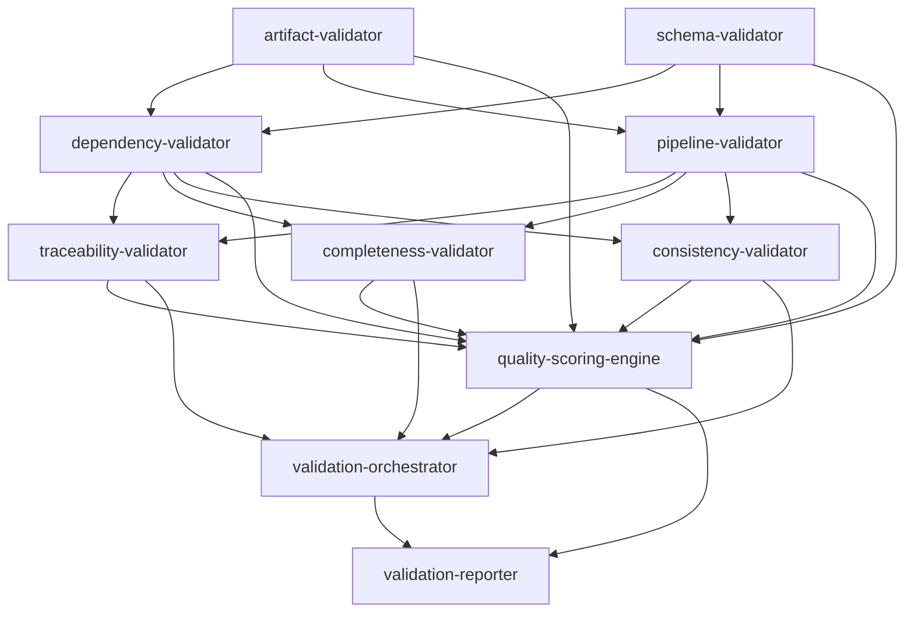

# Validation Engine — Execution Graph

## v0.7.1 notes

- Findings partitioned at `validation/<worker_id>/` (`folder_mirror`).
- Order owned by `pipeline.waves`; orchestrator merges only.
- Gate packages emit `gate-validation-report`.
