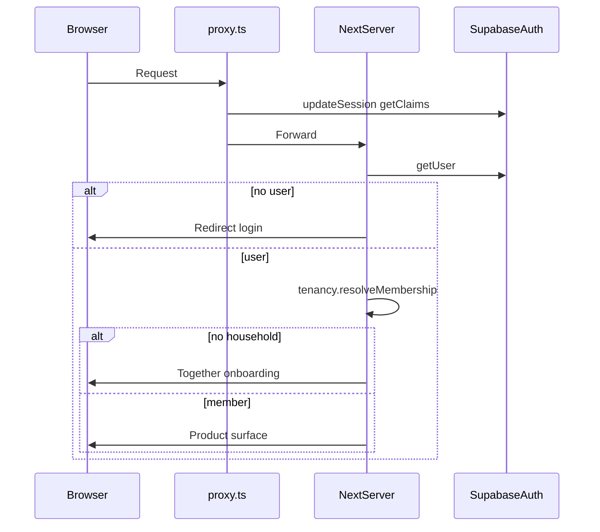
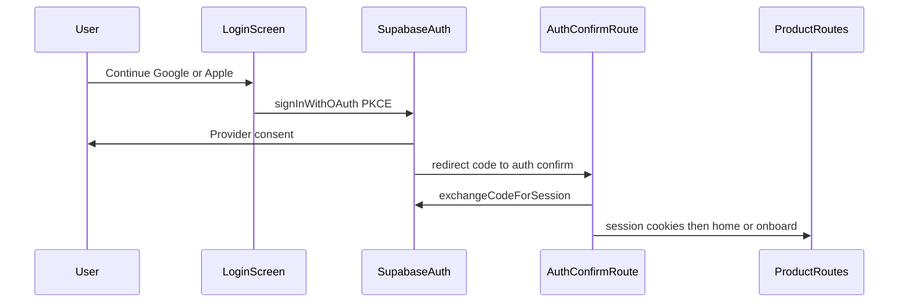

# Authentication Flow

## Providers

| Provider | Mechanism |
|----------|-----------|
| Google | Supabase Auth OAuth (web PKCE) |
| Apple | Supabase Auth OAuth (web PKCE) |
| Email + Password | Supabase Auth email provider |

Guest mode is **not** allowed. App identity = `auth.users.id`. Same verified email across providers → one user where Supabase linking supports it (`BR-02b`).

## Login priority

1. Continue with Google  
2. Continue with Apple  
3. Divider  
4. Continue with Email  

## Session refresh (all providers)

## OAuth sign-in

## Email sign-in

Login Continue with Email → `signInWithPassword` → same SSR cookie session → home or onboard. Register / forgot-password remain email paths; confirm/recovery reuse `/auth/confirm`.

## Account linking

Prefer Supabase automatic identity linking for same verified email. Authenticated `linkIdentity` for add-provider. No duplicate profiles or memberships. Conflicts fail closed.

## Sign-out and delete

Server-side `signOut` clears cookies; delete-account uses privileged server path only. See Technical Security Specs and stories `ST-E02-006`.
