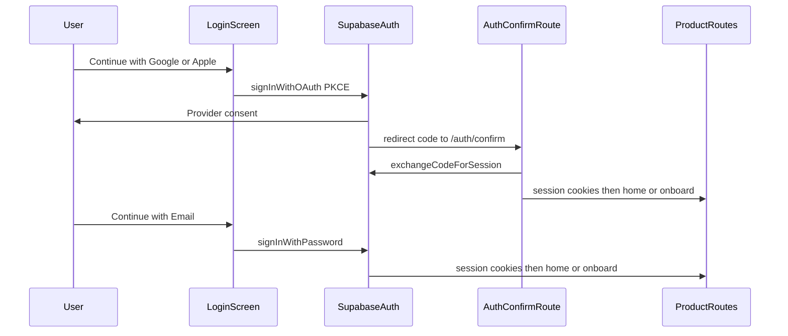

# Authentication Flow v2

## Purpose

Define the official authentication strategy for ViNha / family-finances after the email/password baseline. This board pack is advisory: frozen Product / Technical / Blueprint / Sprint CURRENT packs are **not** mutated here. Deltas below are proposals for a future SoT version bump.

## Providers (supported)

| Provider | Mechanism | Primary surface |
|----------|-----------|-----------------|
| Google | Supabase Auth OAuth (web PKCE) | Login — Continue with Google |
| Apple | Supabase Auth OAuth (web PKCE) | Login — Continue with Apple |
| Email + Password | Supabase Auth email provider | Login — Continue with Email; Register; Forgot password |

**Guest mode is not allowed.** Unauthenticated users may only use authentication and public marketing/system routes. Product money surfaces remain gated by `REQ-002` / `BR-02` (authenticated active household membership).

## Account model

- Application identity = Supabase `auth.users.id`.
- Users who sign in with different providers but the **same verified email** must resolve to the **same** Auth user where Supabase identity linking supports it.
- Do not create duplicate app profiles, memberships, or household attachments for the same person across providers.
- See [account-linking.md](./account-linking.md).

## Entry and exit

| Entry | Path |
|-------|------|
| Splash (no session) | → Welcome |
| Splash (session) | → Home (or onboard when S2 membership exists) |
| Welcome | → Login / Register |
| Unauthenticated product gate | → Login |
| OAuth / email confirm / recovery | → `/auth/confirm` exchange → Home or safe `next` |
| Forgot password | → Login |

| Exit after successful auth | Path |
|----------------------------|------|
| Session established, no membership | Home or onboard (S2) — unchanged product rules |
| Session established, membership | Product surfaces |
| Auth failure | Stay on Login / Confirm error UI; no guest fallback |

## Login UX (locked)

Priority on `auth.login`:

1. **Continue with Google**
2. **Continue with Apple**
3. Divider
4. **Continue with Email** (inline email + password + Sign in)
5. Register link
6. Forgot password link

OAuth-first; email remains first-class, not removed.

## High-level flow

Register (email/password) and forgot-password remain as in S1 email baseline. OAuth users do not need password register; the provider creates the Auth user on first successful consent (subject to linking rules).

## Session establishment

Unchanged platform pattern:

1. Supabase SSR cookie session via `@supabase/ssr`.
2. `proxy.ts` refreshes claims (`getClaims()`) on navigations.
3. Application reads identity with `getUser()` (not trusting client-only session).
4. Money actions still require `assertMoneyActionAllowed` (auth + active membership).

OAuth and email paths both end in the same cookie session after confirm exchange or password sign-in.

## Product Definition deltas (proposal only)

Do **not** edit `artifacts/product-definition/CURRENT` in this freeze. Future bump should:

| ID | Change |
|----|--------|
| `F-Auth` / `ft-auth` | Expand feature text: Google, Apple, Email+Password; no guest; OAuth-first login |
| `REQ-002` | Keep membership rule for money actions |
| **`REQ-002a` (new)** | Users may authenticate via Google OAuth, Apple OAuth, or email+password through Supabase Auth; guest access is forbidden |
| **`BR-02b` (new)** | One Auth user per verified email across linked providers; no duplicate profiles when linking is supported |
| `AC-002` | Keep; add AC coverage for OAuth session + linking in acceptance mapping when stories land |
| `WF-Auth` / `API-Session` | Extend workflows to include OAuth start, callback, link, sign-out, delete-account |
| Logout / delete | Treat as account lifecycle under `F-Auth` (see security-review + sprint-impact) |

## Compatibility

Strategy is **Supabase Auth–native**:

- Hosted providers (Google, Apple, Email) configured in the Supabase project.
- PKCE code exchange at existing `/auth/confirm`.
- Identity linking capabilities as documented by Supabase (automatic and/or manual).
- No custom OAuth token store outside Supabase session cookies.

## Related pack docs

- [oauth-flow.md](./oauth-flow.md)
- [account-linking.md](./account-linking.md)
- [security-review.md](./security-review.md)
- [sprint-impact.md](./sprint-impact.md)
