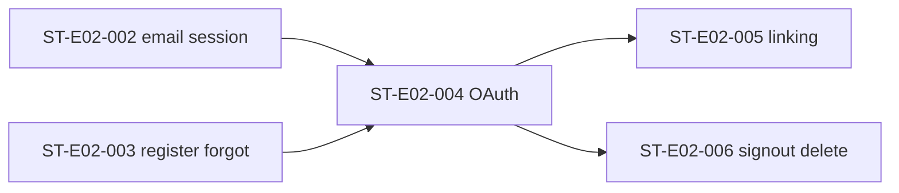

# Sprint Impact — Authentication Stories Only

## Status of S1 email baseline

Sprint execution reports S1 committed email stories (`ST-E02-001` … `ST-E02-003`) as frozen / `STORIES_COMPLETE`. This board **does not** rewrite those stories and **does not** mutate `artifacts/sprint-planning/CURRENT` or `artifacts/implementation-plan/CURRENT`.

OAuth + linking + logout/delete are **additive** authentication work proposed below for a future planning version bump (S1 residual auth slice, S1.1, or early S2 — planning board chooses the sprint label later).

## Proposed stories (E02)

| Story | Priority | Title | Done when |
|-------|----------|-------|-----------|
| `ST-E02-004` | P0 | OAuth login (Google + Apple) | Login UX OAuth-first; `signInWithOAuth`; confirm exchange; i18n; smoke tests |
| `ST-E02-005` | P0 | Identity linking + conflict UX | Auto-link config documented; conflict Alert codes; optional authenticated `linkIdentity` entry |
| `ST-E02-006` | P1 | Sign-out + delete account | `signOut` adapter; delete-account server path + confirm UX; cookies cleared |

Dependencies:

## Task sketch

### ST-E02-004

| Task | Work |
|------|------|
| T-E02-004-a | Dashboard: enable Google + Apple; redirect allowlist `/auth/confirm` |
| T-E02-004-b | Application `startOAuthSignIn` + Server Action / client start |
| T-E02-004-c | Login UI: Google → Apple → divider → email block → register/forgot |
| T-E02-004-d | Confirm path regression (code exchange) |
| T-E02-004-e | i18n en/vi + Playwright smoke (buttons + chrome; IdP happy path env-gated) |

### ST-E02-005

| Task | Work |
|------|------|
| T-E02-005-a | Ops: automatic linking decision recorded |
| T-E02-005-b | Map linking/conflict errors to stable UI codes |
| T-E02-005-c | Optional settings entry for `linkIdentity` (if in scope) |

### ST-E02-006

| Task | Work |
|------|------|
| T-E02-006-a | `app/auth/signout` or action + nav entry |
| T-E02-006-b | Delete account command (server-only privileged path) + confirm UI |
| T-E02-006-c | Tests for cookie clear / unauthenticated gates |

## Definition of Ready (OAuth stories)

- [ ] Supabase project has Google provider credentials  
- [ ] Apple Services ID + key configured (or Apple story explicitly deferred with board waiver — default is **both** Google and Apple in ST-E02-004)  
- [ ] Redirect URLs include all deployed origins’ `/auth/confirm`  
- [ ] SoT version bump applied **or** implementation explicitly tracks this pack as temporary SoT for auth UX  
- [ ] Pattern v1 shells (`AuthScreenShell`, `StatusAlert`, `Button`) reused  

## Blockers to add (sprint-planning proposal)

| ID | Blocker | Stories |
|----|---------|---------|
| B-ENV-03 | Google OAuth client not configured in Supabase | `ST-E02-004` |
| B-ENV-04 | Apple Sign In not configured in Supabase | `ST-E02-004` |
| B-ENV-05 | Automatic identity linking policy unset | `ST-E02-005` |

Existing `B-ENV-01` / `B-ENV-02` remain for email Auth.

## Sprint Planning deltas (proposal only)

Files to patch in a **future** sprint-planning / implementation-plan version (not this freeze):

- `story-order.md` / `stories/E02.md` — append ST-E02-004…006  
- `task-breakdown.md` — OAuth / linking / sign-out tasks  
- `blockers.md` — B-ENV-03…05  
- `execution-checklist.md` — OAuth checklist  
- `success-criteria.md` — OAuth-first login + no guest  
- `definition-of-ready.md` — provider credentials  
- Implementation plan `stories/detail/ST-E02-004.md` (etc.) when planning board runs  

## Master SoT delta checklist (auth only)

Use when bumping frozen packs later:

### Product Definition

- [ ] Feature Catalog / Feature Spec — expand `F-Auth`  
- [ ] Requirements — add `REQ-002a`  
- [ ] Business Catalog — add `BR-02b`  
- [ ] Acceptance / Traceability — wire new IDs  
- [ ] MVP / journeys — OAuth-first login; no guest  

### Screen Blueprints

- [ ] `authentication/login.md` — hierarchy OAuth-first  
- [ ] `authentication/welcome.md` / `register.md` / `confirm.md` — notes  
- [ ] `user-flows/flow.auth-onboard-home.md` — OAuth alt  
- [ ] `inventory.json` / route map if actions change  

### Technical Specification

- [ ] `frontend/Page-Specifications.md` — OAuth + sign-out  
- [ ] `modules/tenancy.md` — new commands  
- [ ] `security/Security-Specs.md` — providers, linking, logout, delete  
- [ ] Implementation contracts / API-Session if listed  

### Sprint / Implementation plan

- [ ] Stories ST-E02-004…006 + tasks + blockers  
- [ ] Do not reopen ST-E02-002 acceptance except via explicit amendment note  

## Implementation gate

This pack freezes strategy only (`implementation_started: false`).  
**Do not start coding** until an explicit implementation approval references this freeze and (preferably) SoT bumps above.
