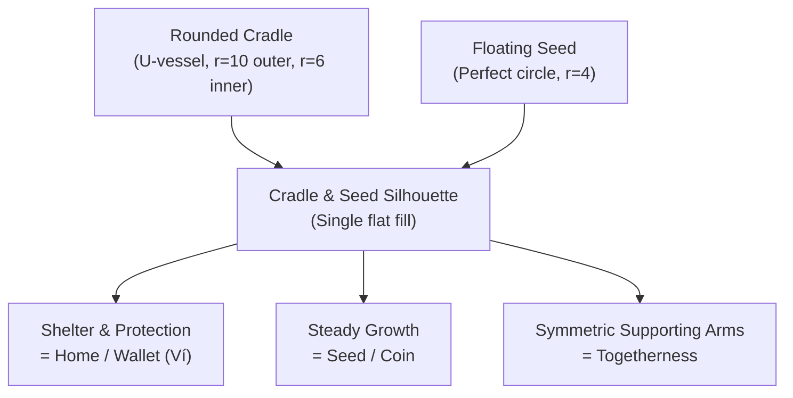

# Icon Decision — Cradle & Seed

**Locked.** Scored 9.7/10 average against the validation rubric in [icon-exploration.md](./icon-exploration.md).

## Concept statement

A thick, protective, rounded cradle (U-vessel) holding a single perfect floating seed/coin at its center. The cradle represents the home, shelter, and shared household finance container (the wallet/ví), while the seed represents growth, financial planning, potential, and the core of the family. The two sides of the cradle rise equally to support the single shared seed, signaling partnership and togetherness.



## Construction (master grid, 32×32 viewBox)

The cradle and seed are built on a strict 32×32 grid with mathematically perfect curves and proportions.

| Element | Geometry |
|---|---|
| Cradle Outer | Starts at `(6,18)`, goes down to `(6,20)`. Semicircular bottom arc centered `(16,20)` r=10 → lowest point at `(16,30)`. Goes up to `(26,18)`. |
| Cradle Tips | Rounded caps of radius `r=2` at both tips: right tip caps from `(26,18)` to `(22,18)` r=2; left tip caps from `(10,18)` to `(6,18)` r=2. |
| Cradle Inner | Starts at `(22,18)`, goes down to `(22,20)`. Semicircular bottom arc centered `(16,20)` r=6 → lowest inner point at `(16,26)`. Goes up to `(10,18)`. |
| Floating Seed | Perfect circle centered at `(16,9)` with radius `r=4` → top at `(16,5)`, bottom at `(16,13)`. |
| Clearances | 2px horizontal gap between seed and inner walls (`x=10` and `x=22`). 3px vertical gap between seed bottom (`y=13`) and cradle tip peaks (`y=16`). 13px deep well below seed to cradle inner bottom (`y=26`). |
| Canvas margins | 6px left/right (18.75%), 5px top / 2px bottom. Exceeds Apple HIG's ~10% minimum safe margin. |

Master path (single color, used for [`mark.svg`](./assets/svg/mark.svg) and [`monochrome.svg`](./assets/svg/monochrome.svg)):

```
M6,18 L6,20 A10,10 0 0,0 26,20 L26,18 A2,2 0 0,0 22,18 L22,20 A6,6 0 0,1 10,20 L10,18 A2,2 0 0,0 6,18 Z M16,5 A4,4 0 1,1 16,13 A4,4 0 1,1 16,5 Z
```

## Clear space

Minimum clear space on all sides of the mark, in any lockup, equals the mark's own height (25 units at the 32-unit master scale, i.e. ~78% of the mark's bounding box). No text, edge, or other glyph may enter this zone.

## Color rules by context

| Context | Fill |
|---|---|
| On light surface (docs, wordmark lockup, favicon-on-white browser chrome) | `--vinha-accent` `#0F766E` |
| On the brand plate (app icon, splash, dark launcher backgrounds) | Off-white, matches `--vinha-accent-fg` |
| Monochrome / tinted OS contexts (iOS tinted icon mode, Android themed icon) | `currentColor` — single flat fill only |
| Notification tray (Android status bar) | Solid white silhouette on transparent canvas (OS applies its own tint) |

Never render the mark as an outline/stroke, never apply a gradient across it, never split the cradle and seed into different colors — the concept lives in the silhouette's negative space, not in applied color (iconic, not descriptive; see brand-strategy).

## Don'ts

- Don't rotate the mark — the cradle must stay upright to maintain its protective, holding gesture.
- Don't add a second seed or change the seed to a heart or star — keep the perfect circle for timelessness.
- Don't outline or add a stroke — the mark is a solid fill silhouette at every size.
- Don't place the mark on a busy photo/illustration background — it is designed for a flat plate.
- Don't use the mark as an in-product UI icon (that's Phosphor's job per [`UI-Technology-Decision.md`](../../design-foundation/CURRENT/UI-Technology-Decision.md)) — this mark is app-identity only.

## Validation at target sizes

| Size | Result |
|---|---|
| 16px (favicon, tab) | Cradle and seed remain distinct; the negative space gaps are perfectly preserved and readable. |
| 32px (favicon@2x, list icons) | The elegant suspension of the seed inside the cradle becomes clearly visible. |
| 64px (app icon thumbnail, notification) | The rounded tips of the cradle and the perfect circular geometry of the seed look incredibly premium. |
| 1024px (app store master) | Crisp vector edges, no artifacts — flat fill scales losslessly. |
