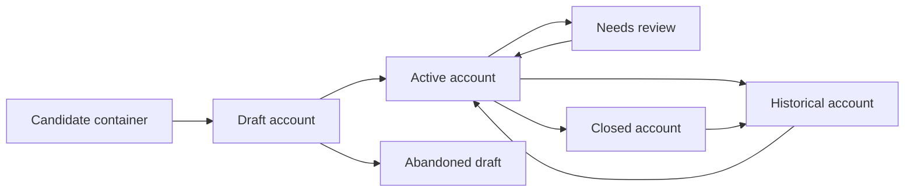

# Lifecycle

## Complete Lifecycle

## Beginning

The lifecycle begins when a household identifies a real-world container worth tracking.

The container may be:

- Bank account.
- Cash.
- E-wallet.
- Savings-like account.
- Card-adjacent account context.
- Other household-relevant real container.

The first business action is recognition: the household decides that this container belongs in the household money record.

## Normal Operation

An active account:

- Has a household-recognizable name.
- Has a broad type.
- Has a starting or recorded balance.
- May contribute to real position if eligible.
- Can provide account context for transactions.
- Can be reviewed against real-world records.
- Must remain distinct from jars, goals, and plans.

## Changes

The household may change:

- Account name.
- Broad type.
- Household relevance.
- Active/historical status.
- Recognition metadata.
- Recorded balance through an explainable adjustment.

Changes must preserve historical understanding.

## Completion

Accounts do not complete like goals or loans. They remain active while the real-world container matters to the household.

An account may become complete only in the practical sense that it no longer needs active tracking.

## Termination

Termination occurs when the real-world account is closed, no longer used, or no longer household-relevant.

Termination does not erase history. The business result is historical preservation, not deletion of meaning.

## Recovery

Recovery happens when account truth is uncertain.

Common recovery triggers:

- Recorded balance feels wrong.
- Wrong account type.
- Wrong account name.
- Closed account still appears active.
- Transfer recorded as income or expense.
- Cash count differs from record.

Recovery restores explainability. It does not silently rewrite history.

## Exceptional Situations

Exceptional situations include:

- Credit treated as owned money.
- Jar mapped to account.
- Health attempting to change account data.
- Automatic movement from account without user decision.
- Account in invalid state.
- Stale account used for high-confidence decisions.

The business expectation is to block or reject boundary violations and route recovery to the responsible domain where needed.

