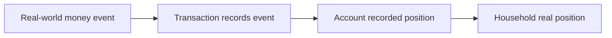
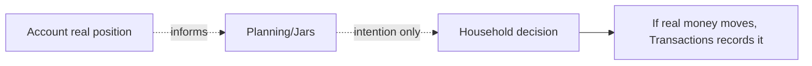

# Money Flow

## Principle

Accounts do not move money by themselves. Accounts identify where real money is recorded. Transactions record money movement. Planning records intention. Health reads only.

## Real Ledger

Real Ledger money movement affects account position through transaction interpretation.

Examples:

- Salary enters a bank account.
- Expense leaves an e-wallet.
- Cash is withdrawn from a bank account.
- Transfer moves money between two household accounts.
- Savings maturity settles into an account.
- Card repayment leaves a bank account.

Business behavior:

- Income increases the affected account's recorded position.
- Expense decreases the affected account's recorded position.
- Transfer decreases one account and increases another.
- Own-account transfer is neutral to total household real position.
- Credit limit is never owned money.

## Planning

Planning does not move account money.

Business behavior:

- Jars may be informed by account reality.
- Jars must not map directly to accounts as balances.
- Planning allocations must not subtract from account balance.

## Inbox

Inbox may ask for a human decision when account-related context needs attention.

Examples:

- Unclear transaction account.
- Savings maturity payout account decision.
- Transfer needing review.
- Account discrepancy needing household attention.

Business behavior:

- Inbox does not own account balance.
- Inbox does not move money by itself.
- Inbox exists only when a human decision is needed.

## Read-Only

Read-only consumers may summarize or display account truth.

Examples:

- Home reads real position.
- Health reads account position.
- Together protects access.
- Export reads account facts.

Business behavior:

- Read-only consumers do not alter account facts.
- Health must remain read-only (BR-24).

