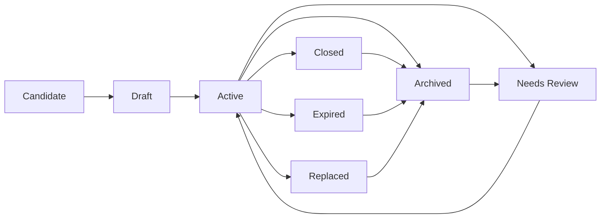

# Lifecycle

## Lifecycle Overview

## Beginning

The lifecycle begins when a household decides a card is relevant to household money.

Business facts required before the card becomes active:

- Card is recognizable to the household.
- Issuer is known.
- Card type is known enough to classify as debit, credit, or prepaid.
- For credit cards, statement date, due date, and credit limit are known enough for safe tracking.

If required facts are missing, the card remains Draft or Needs Review.

## Normal Operation

During normal operation:

- Card purchases are recognized as card activity.
- Credit-card purchases increase card obligation, not real cash.
- Debit-card purchases are account-access spending and depend on Accounts and Transactions for real money movement.
- Credit-card activity is associated with a billing period when possible.
- Statement amount, paid amount, and remaining due amount describe repayment pressure.
- Repayment reduces card obligation and must identify the real money source.
- Refunds and cashback reduce obligation or create credit context but are not ordinary income unless the business meaning supports it.

## Changes

Business changes may include:

- Issuer name correction.
- Statement date or due date correction.
- Credit limit correction.
- Lightweight status change.
- Fee, interest, refund, or cashback clarification.
- Card-origin installment interpretation.
- Household responsibility clarification.

Changes must preserve historical meaning. A change must not silently rewrite prior card purchases or repayments.

## Completion

Cards do not complete in the same way as loans. A credit-card billing period completes when its remaining due amount is fully paid, credited, or otherwise considered settled by the household record.

Completion of one billing period does not close the card. The card remains Active unless closed, expired, replaced, or archived.

## Termination

Termination occurs when the household no longer uses the card as an active instrument.

Valid termination outcomes:

- Closed: card relationship has ended or is treated as ended.
- Expired: card is no longer valid due to expiry.
- Replaced: card identity changed while business history remains connected.
- Archived: card is no longer current in household use but remains historical.

Termination must preserve history.

## Recovery

Recovery occurs when a prior card state or fact is questioned.

Examples:

- Closed card has remaining obligation.
- Archived card has an unresolved refund.
- Due date was wrong.
- Payment was recorded but issuer did not treat it as posted.
- Card replacement needs historical continuity.

Recovery moves the card into Needs Review until the household restores a valid interpretation.

## Exceptional Situations

Exceptional situations include lost cards, unexpected fees, late repayment, partial repayment, refund timing mismatch, statement mismatch, partner disagreement, card decline, or uncertain provider truth.

The deterministic business response is:

1. Preserve the last valid card state.
2. Mark uncertain truth as Needs Review.
3. Do not invent provider-confirmed facts.
4. Do not execute automatic payment.
5. Keep real money movement separate from card obligation interpretation.
