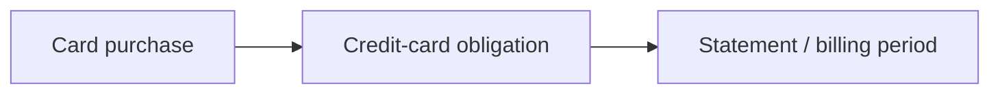
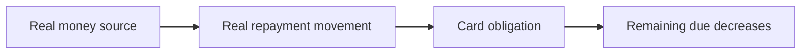
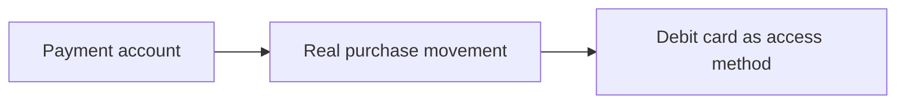
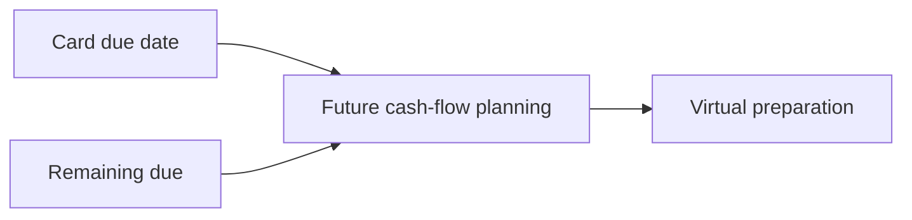
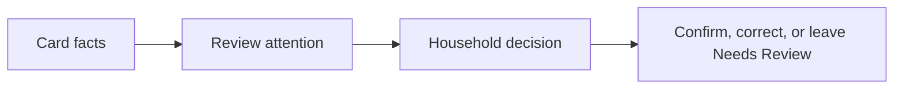
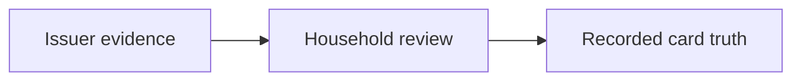

# Money Flow

## Real Ledger

Credit-card purchase creates obligation, not immediate household cash outflow.

Credit-card repayment is a real ledger movement from a real money source.

Debit-card purchase is account-funded spending.

Business rules:

- Accounts owns where real money is.
- Transactions owns real money movement.
- Cards owns card-specific obligation meaning.
- Credit limit and available credit are not real money.
- Card repayment is not the same financial event as the original card purchase.

## Planning

Planning may read card due dates and remaining due amounts for future cash-flow awareness.

Business rules:

- Planning does not move money.
- Planning does not reduce card obligation.
- Virtual preparation belongs to Planning, Jars, or Goals, not Cards.

## Inbox

Inbox may request attention for due dates, unclear charges, refunds, fees, or repayment uncertainty.

Business rules:

- Inbox owns the review surface.
- Cards owns underlying card facts.
- Inbox cannot execute repayment.

## Read-Only

Issuer apps, statements, SMS, email, and screenshots may inform card review.

Business rules:

- Read-only evidence can increase confidence.
- Provider-confirmed feeds and automatic reconciliation are deferred.
- Household-recorded truth must not pretend to be provider-confirmed truth.
