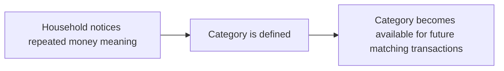
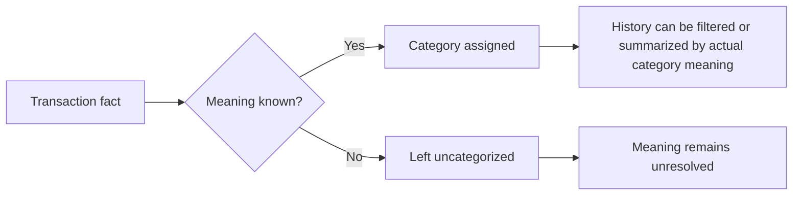

# Lifecycle

This is a business lifecycle only. It does not define implementation state, database state, or technical contracts.

## Beginning

A category begins when the household needs a reusable classification label.

Beginning conditions:

- Household context exists.
- Category meaning is understandable.
- Category kind is income or expense.
- Category does not claim to hold money or planning capacity.

## Normal Operation

Normal operation occurs when transaction facts receive category meaning.

Normal behavior:

- A transaction may be categorized.
- A transaction may remain uncategorized.
- Category meaning can be read by Transactions, Planning, Inbox, Health, and other domains within their own boundaries.
- Category summaries describe actual past transaction meaning only.

## Changes

Allowed changes:

- Correct category assignment on a transaction.
- Rename a category while preserving historical comprehension.
- Archive a category from future use.
- Restore an archived category.
- Accept or ignore a provider/merchant category suggestion.
- Discuss or question shared category meaning.

Change principle:

- Changes clarify meaning.
- Changes do not move real money.
- Changes do not change account truth.
- Changes do not create planning capacity.

## Completion

Categories do not have completion in the same sense as goals, loans, or savings products.

A category's ordinary useful life is complete when the household no longer uses it for new transactions. At that point it may become archived while retaining historical meaning.

## Termination

Business termination means the category is no longer available for future selection.

Termination does not erase:

- Historical transaction meaning.
- Prior summaries that relied on the category.
- The household's ability to understand old records.

## Recovery

Recovery occurs when a category action was mistaken or incomplete.

Recovery paths:

- Uncategorized transaction receives a valid category.
- Wrong category assignment is corrected.
- Archived category is restored.
- Rename confusion is resolved by preserving prior meaning.
- Provider suggestion is rejected or replaced by household meaning.

## Exceptional Situations

Exceptional situations include:

- Attempting to make a category hold money.
- Attempting to show category available balance.
- Treating category as a budget or jar.
- Treating provider category as final truth.
- Forcing category meaning when the household does not know.
- Assigning income category to expense meaning or expense category to income meaning.

In all exceptional situations, the business result is no accepted category-state change unless the action can be reframed as valid classification behavior.
