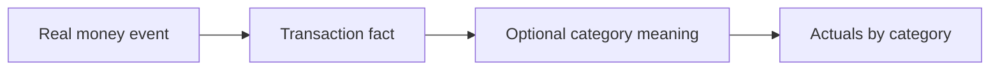
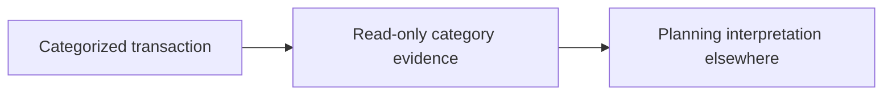
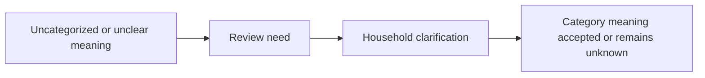
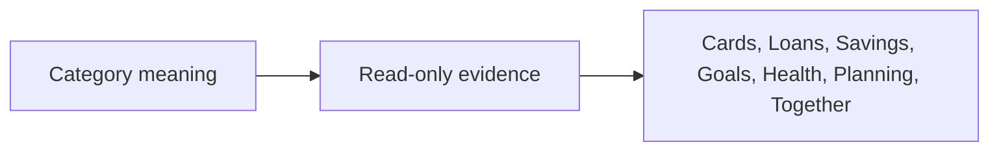

# Money Flow

Categories never move money. They classify the meaning of money facts.

## Real Ledger

Real Ledger owns real money movement.

Business behavior:

- Category assignment does not change amount, account, date, currency, or direction.
- Category correction does not create or reverse money movement.
- Category actuals summarize recorded transaction facts only.
- Category actuals are not balances.

## Planning

Planning owns virtual intention.

Business behavior:

- Categories may inform jar mapping or planning review.
- Categories do not create jar capacity.
- Categories do not allocate income.
- Categories do not enforce spending limits.

## Inbox

Inbox owns review work.

Business behavior:

- Categories define vocabulary used during review.
- Inbox owns pending, resolved, or dismissed review state.
- Review does not move money by itself.

## Read-Only

Other domains may read category meaning.

Business behavior:

- Health reads category patterns but cannot change them.
- Cards or providers may supply suggestions but do not own household category truth.
- Loans, Savings, and Goals keep their own financial meaning.

## Explicit Non-Movements

The following never happen in Categories:

- Category receives money.
- Category sends money.
- Category stores money.
- Category shows available money.
- Category reserves money.
- Category pays bills.
- Category settles debt.
- Category funds a goal.
- Category changes Health state.
