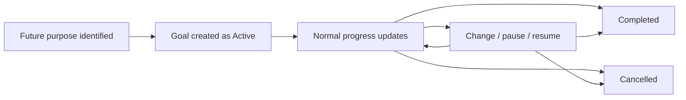

# Lifecycle

## Lifecycle Summary

## Beginning

A goal begins when the household identifies a future purpose worth tracking.

Required business meaning:

- Purpose is understandable.
- Target amount is known enough for household planning.
- Goal is not represented as a real money container.
- Household context is valid.

Valid result:

- Goal becomes Active.

Invalid result:

- No goal state changes. The attempted action is an Invalid Attempt.

## Normal Operation

During normal operation, an Active goal may:

- Receive contribution updates.
- Show progress toward target.
- Carry optional timing pressure.
- Carry simple notes or reason.
- Be visible in household context.
- Be compared with read-only money evidence when available.

Normal operation never moves money.

## Changes

A household may change:

- Name or purpose.
- Target amount.
- Optional target date.
- Simple notes or reason.
- Perceived progress through contribution update.
- Lifecycle state.

Change is valid only when the resulting goal still represents intention and does not claim source-domain truth.

## Completion

A goal may become Completed when the household considers the goal intention fulfilled.

Completion means:

- The goal is no longer actively pursued.
- The household interprets the target as reached or the purpose as fulfilled.

Completion does not mean:

- A purchase happened.
- A payment happened.
- A transfer happened.
- A savings product was withdrawn.
- A real balance exists.

## Termination

A goal may become Cancelled when the household intentionally stops pursuing it before completion.

Cancellation:

- Ends active pursuit.
- Preserves business meaning for history.
- Does not erase prior contribution meaning.
- Does not move money.

## Recovery

Recovery occurs when the household corrects a misunderstanding, stale progress, wrong target, wrong date, or mistaken status.

Recovery result:

- The goal returns to Active or Paused if still relevant.
- The goal remains Completed or Cancelled if the prior terminal decision is still valid.
- Invalid attempts preserve the prior valid state.

## Exceptional Situations

Exceptional situations include emergency use, partner conflict, expired timing, invalid transition, duplicated progress, source-domain conflict, or system interruption.

Business expectation:

- Real money truth remains with source domains.
- Goal intention is corrected, paused, completed, or cancelled as appropriate.
- Prior valid state is preserved when the requested business action is invalid.
