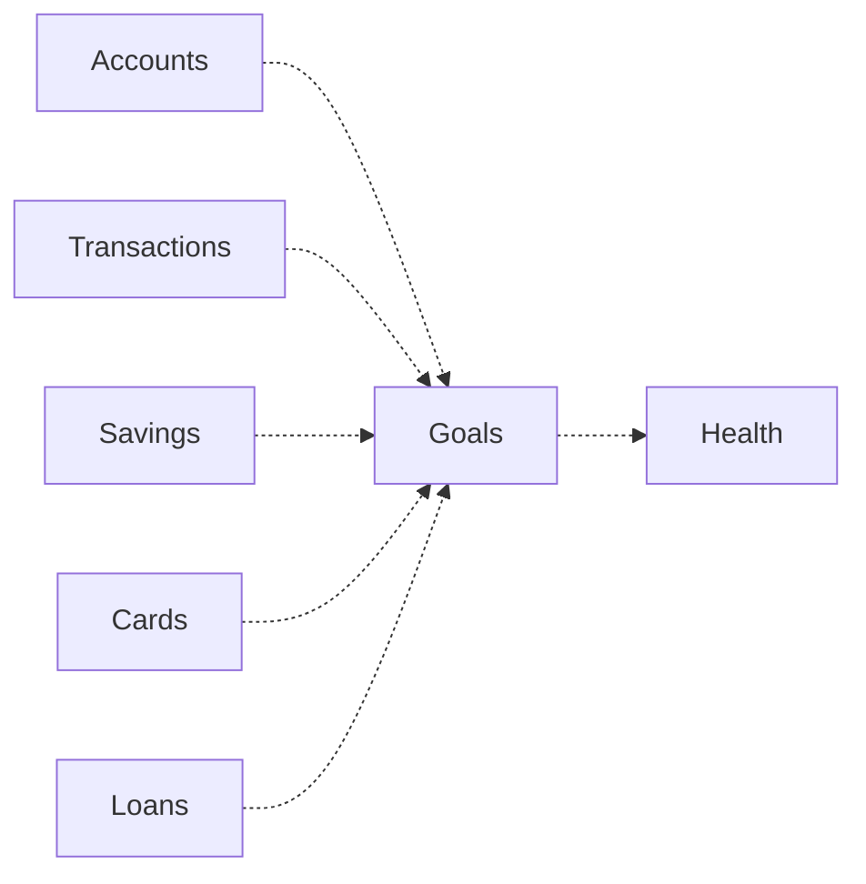

# Money Flow

## Principle

Goals does not move money.

Goals changes household intention and perceived progress. Real money movement belongs to Accounts, Transactions, Savings, Cards, Loans, cash reality, or external providers.

## Real Ledger

Real Ledger flow:

Business behavior:

- Salary received is not a goal contribution unless recorded by the real-money domain and interpreted by the household.
- Transfer to savings is a real transaction or Savings behavior, not a Goals movement.
- Spending goal money is a transaction, cash event, card event, or savings withdrawal.
- Goals may read facts but cannot create real money movement.

## Planning

Virtual Planning flow:

Business behavior:

- Creating a goal creates intention.
- Adding a contribution updates perceived progress.
- Completing a goal ends pursuit of intention.
- Cancelling a goal ends pursuit of intention.
- None of these actions changes the Real Ledger.

## Inbox

Inbox flow:

Business behavior:

- Inbox may carry review needs if goal meaning, evidence, or household decision becomes unclear.
- Inbox does not own goal meaning.
- Inbox does not move money.

## Read-Only

Read-only flow:

Business behavior:

- Accounts provide balance context.
- Transactions provide movement evidence.
- Savings provides product truth.
- Cards and Loans provide obligation pressure.
- Health may read Goals but cannot mutate Goals.

## Prohibited Money Flow

Forbidden:

- Goal progress as account balance.
- Goal contribution as automatic transfer.
- Goal completion as proof of purchase or payment.
- Savings association as ownership of savings product.
- Evidence comparison as source-domain mutation.
- Health insight as goal mutation.
- AI explanation as autonomous goal action.
