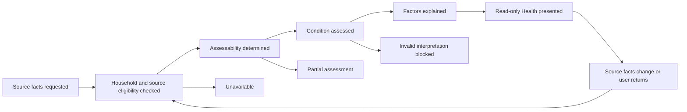

# Lifecycle

Health has an assessment lifecycle, not an owned money-object lifecycle.

## Lifecycle Overview

## Beginning

Health begins when a household requests or receives a Health assessment.

Beginning requires:

- A valid household context.
- Permission to view household financial context.
- At least one visible source fact or an explicit lack-of-data state.

If no valid household context exists, Health is unavailable.

## Normal Operation

Normal operation follows this deterministic order:

1. Check household eligibility.
2. Collect visible source-domain facts.
3. Classify data completeness.
4. Assess condition from grounded factors.
5. Explain each contributing factor.
6. Present read-only condition, factors, completeness, and allowed read-only scenarios.

## Changes

Health changes only when source-domain facts change or the assessment context changes.

Examples:

- A transaction is recorded.
- An account becomes visible or hidden.
- A plan becomes active or inactive.
- An Inbox item opens or closes.
- A card or loan pressure fact changes.
- Medical spending becomes visible.
- Household membership or permission changes.

Health does not change source facts in response.

## Completion

A Health assessment completes when the condition, factors, completeness, and any read-only scenario context are presented or when the assessment is declared unavailable.

Completion does not create a financial outcome.

## Termination

Health assessment terminates for the current request when:

- Household context is invalid.
- Permission is unavailable.
- Source facts cannot be interpreted safely.
- The user leaves the Health context.
- The assessment is superseded by a newer source-fact view.

## Recovery

Recovery occurs when a previously unavailable, incomplete, stale, or invalid assessment becomes assessable again.

Recovery can be triggered by:

- Source facts becoming available.
- Missing context becoming visible.
- Stale facts being refreshed by owning domains.
- Invalid or contradictory source facts being corrected in owning domains.
- Household permission being restored.

## Exceptional Situations

Exceptional situations do not permit Health to mutate other domains.

Examples:

- Emergency spending appears.
- Medical expense pressure appears.
- Partner-visible facts conflict.
- Source data is stale.
- Planning intention is mistaken for real money.
- Health cannot explain a factor.

Expected behavior:

- Health marks the assessment partial, stale, unavailable, or blocked.
- Health explains the reason when possible.
- Health remains read-only.
