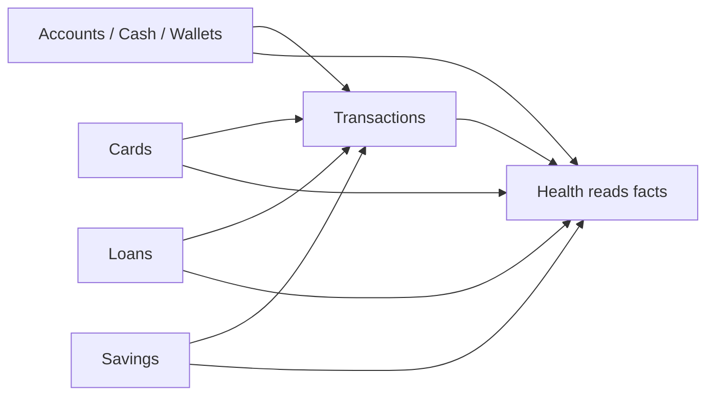
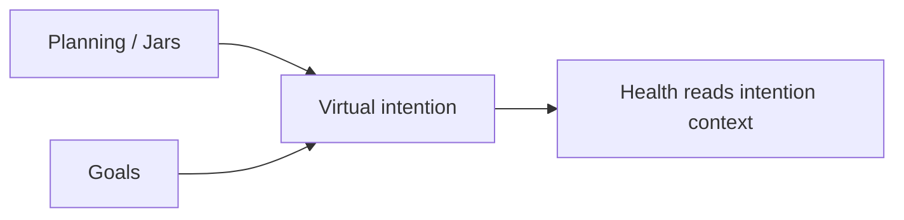
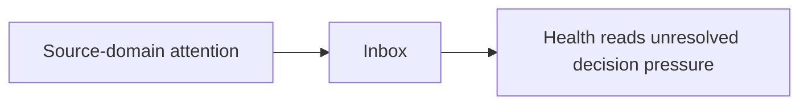
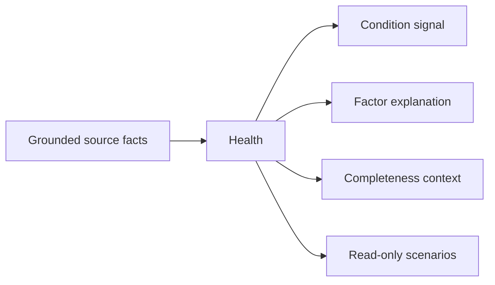

# Money Flow

Health never moves money.

## Real Ledger

Business behavior:

- Real money movement belongs to Accounts, Transactions, Cards, Loans, and Savings.
- Health reads real-money facts only.
- Health must not create a transaction, transfer, repayment, withdrawal, deposit, reconciliation, or balance correction.

## Planning

Business behavior:

- Planning and Goals express intention.
- Health may interpret planning rhythm or emergency intention.
- Health must not treat intention as cash.
- Health must not move value between jars, goals, or accounts.

## Inbox

Business behavior:

- Inbox owns decisions and review outcomes.
- Health may interpret unresolved decision burden.
- Health must not create, resolve, approve, reject, dismiss, defer, or archive Inbox items.

## Read-Only

Business behavior:

- Health output is interpretation only.
- Health output has no accounting effect.
- Health output must never be used as proof that money exists or is spendable.

## BR-01 Protection

Health must always preserve:

- Real Ledger facts are real money truth.
- Planning facts are intention.
- Inbox facts are unresolved attention.
- Health facts are interpretation.

No Health assessment can convert one category into another.
