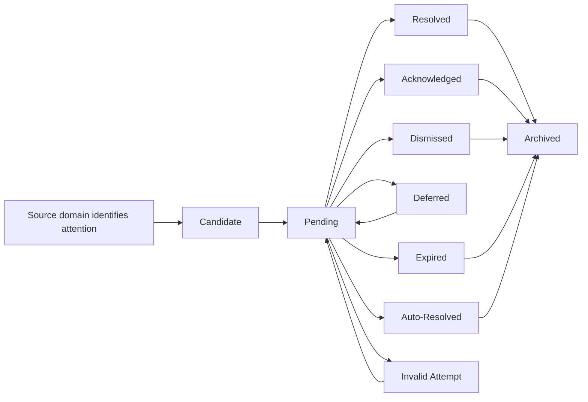

# Lifecycle

## Lifecycle Summary

## Beginning

The lifecycle begins when another domain or accepted business source identifies decision-bearing financial attention.

Examples:

- Transaction meaning is missing.
- A savings maturity needs household action.
- A payment reminder has a time-bound household decision.
- A repeated low-risk item has a previously accepted pattern.

The item starts as Candidate until it satisfies Inbox eligibility.

## Normal Operation

An eligible Candidate becomes Pending.

While Pending:

- The item remains active.
- The household can review it.
- Staleness may be observed.
- Suggestions may be shown if explainable and non-authoritative.
- No real money moves because of Inbox alone.

## Changes

Pending items may change through valid household outcomes:

- Resolve when the household makes the required decision.
- Acknowledge when awareness is sufficient.
- Dismiss when the item does not need active attention.
- Defer when context is intentionally missing.
- Expire when a time-bound item is no longer active.
- Auto-resolve when a constrained accepted pattern applies.

## Completion

Completion occurs when active attention ends through Resolved, Acknowledged, Dismissed, Expired, or Auto-Resolved.

Completion does not mean:

- Money moved.
- A bill was paid.
- A transaction was corrected.
- A partner agreed.
- Health changed.

It means Inbox no longer treats the item as active attention.

## Termination

Archived is the historical terminal state for normal business work. Archived items remain business memory and decision history.

## Recovery

Recovery occurs when a prior item needs attention again because:

- New source evidence appears.
- A prior resolution is later questioned.
- A dismissed item was not actually irrelevant.
- Deferred context becomes available.
- The owning domain rejects or cannot apply the outcome.

Recovery returns the item to Pending or creates a new Candidate tied to the new source attention. The original history must remain understandable.

## Exceptional Situations

Invalid attempts do not change the valid prior state.

Examples:

- Resolving without required decision context.
- Treating a reminder expiration as payment.
- Attempting to route outcome to the wrong owning domain.
- Trying to use Inbox for generic notification behavior.
