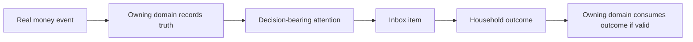

# Money Flow

Inbox does not move money. It carries financial attention and decision outcomes.

## Real Ledger

Real money moves in Accounts, Transactions, Cards, Loans, or Savings. Inbox may observe or route attention about that movement.

Business rules:

- Inbox resolution does not move real money.
- Inbox expiration does not prove a bill was paid.
- Inbox acknowledgement does not certify a ledger fact.
- Source domains remain authoritative.

## Planning

Planning is virtual intention. Inbox may carry decisions that affect planning interpretation, but it cannot create real balance.

Business rules:

- Inbox cannot turn a jar or goal into real money.
- Planning owns allocation and intention.
- BR-01 remains binding.

## Inbox

Inbox movement is attention movement, not money movement.

Examples:

- Pending -> Resolved.
- Pending -> Acknowledged.
- Pending -> Dismissed.
- Pending -> Expired.
- Pending -> Auto-Resolved.

## Read-Only

Read-only information may inform Inbox but does not become money truth.

Examples:

- Reminder message.
- Source reason.
- Workload count.
- Staleness context.
- Health-read context.

Business rules:

- Read-only context cannot mutate Inbox unless a valid business flow changes state.
- Health may read Inbox burden but cannot write to Inbox.
