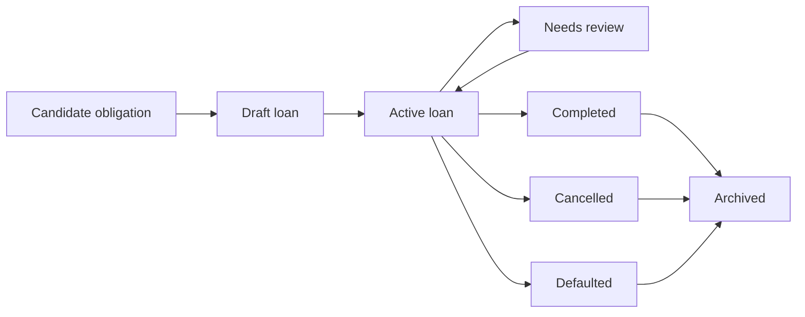

# Lifecycle

## Lifecycle Overview

## Beginning

A loan begins as a candidate obligation when the household identifies borrowing that may need tracking.

The candidate becomes a draft when the household chooses to record it.

The draft becomes active only when the minimum business facts are known:

- Household-recognizable loan name or purpose.
- Lender identity.
- Original principal.
- Repayment term or schedule basis.
- Expected payment amount or enough information to understand repayment.
- Start or first due timing.

## Normal Operation

An active loan operates through repeated review and repayment:

- Upcoming due date becomes relevant.
- Household chooses payment source.
- Real repayment occurs outside or alongside ViNha.
- Repayment is recorded as a real ledger movement and loan history fact.
- Recorded remaining principal changes according to recorded repayment meaning.
- The next expected payment remains visible until the loan is completed or leaves active use.

## Changes

Allowed business changes:

- Correct recognition details such as name, lender, broad type, note, or household relevance.
- Correct loan facts before they become trusted history.
- Record known rate change for variable or promotional-rate loans.
- Mark uncertainty when provider truth, payment status, or household understanding no longer matches the record.

Changes must preserve historical meaning. A change must not silently rewrite real repayment history.

## Completion

A loan completes when the household determines the repayment obligation is fully settled.

Completion means the household record is no longer active. It does not automatically prove lender closure unless lender confirmation exists outside the current approved scope.

Completed loans retain history.

## Termination

Termination can occur through:

- Cancellation before the loan remains active.
- Default when repayment is materially failed and no longer follows normal active behavior.
- Archive when the household wants a non-active loan out of current view while preserving history.

Termination is not deletion of business meaning.

## Recovery

Recovery occurs when uncertainty or incorrect state is resolved:

- Needs Review can return to Active after clarification.
- Incorrect completion can return to Needs Review, then Active if an obligation remains.
- Defaulted or cancelled records may be archived after household review.
- Wrong facts can be corrected if the correction remains explainable.

## Exceptional Situations

Exceptional situations include late payment, partial payment, reversed payment, provider mismatch, wrong loan facts, partner conflict, family-loan ambiguity, rate change, and stale payoff estimate.

The deterministic business response is:

1. Preserve previous valid loan state.
2. Mark uncertainty when truth is not clear.
3. Prevent automatic money movement.
4. Require household confirmation before state-changing interpretation.

