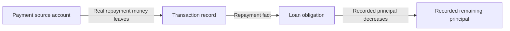
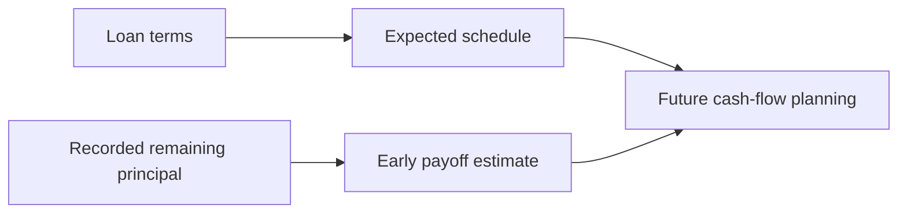
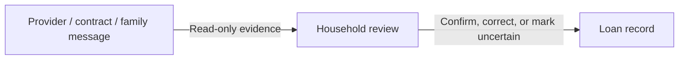

# Money Flow

## Real Ledger

Loan disbursement, if recorded as household money, is a real ledger movement owned by Transactions and Accounts.

Loan repayment is always a real ledger event when it represents money leaving a household account, wallet, cash, or other real source.

Business rules:

- Accounts own where money is.
- Transactions own the real movement.
- Loans own repayment meaning and obligation progress.
- Repayment must not be treated only as an expense category.
- Unknown fee, penalty, or interest components must not be invented.

## Planning

Planned schedules and payoff estimates are planning information.

Business rules:

- Expected schedule does not move money.
- Early payoff estimate does not close the loan.
- Payoff intention is not a real repayment.
- Loan must not own virtual payoff jars.

## Inbox

Inbox can surface review or attention items based on loan state.

Business rules:

- Inbox owns the review surface.
- Loans owns the underlying obligation facts.
- Inbox reminder does not execute repayment.

## Read-Only

Provider statements, contracts, bank screens, or family messages can inform review.

Business rules:

- Read-only evidence can improve confidence.
- Deferred provider import is not part of current business scope.
- Product values remain recorded truth unless provider-confirmed in a later approved scope.

