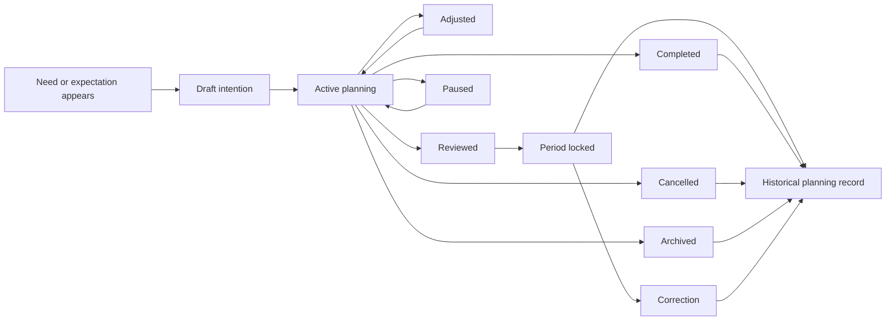

# Lifecycle

## Complete Lifecycle

## Beginning

Planning begins when a household recognizes a financial intention:

- Expected salary or income.
- A spending purpose.
- A goal.
- A recurring obligation.
- A due date.
- A family-support expectation.
- A debt payoff or savings preparation intention.
- A month or period ready for review.

Beginning state: Draft.

## Normal Operation

Normal operation includes:

- Assign expected income to purposes.
- Maintain active jars and goals.
- Track recurring expectations.
- Observe expected due pressure.
- Read factual context from other domains.
- Compare intention with evidence.
- Adjust planning as the month changes.

Normal operating state: Active.

## Changes

A household may change Planning when:

- Income expectation changes.
- Amount or percentage changes.
- Goal target changes.
- Due expectation changes.
- Recurring expectation changes.
- An emergency or mismatch appears.
- A partner identifies missing or incorrect intention.

Change state: Adjusted, then Active.

## Completion

An intention is completed when the household considers its planning purpose fulfilled.

Completion does not prove real money moved. If real money moved, the owning domain records that fact.

Completion state: Completed, then Historical.

## Termination

An intention may terminate when:

- It is cancelled.
- It is archived.
- It becomes irrelevant.
- It is replaced by another intention.
- The household no longer needs it.

Termination states: Cancelled or Archived, then Historical.

## Recovery

Recovery occurs when an earlier plan was wrong, incomplete, disrupted, or misunderstood.

Recovery paths:

- Active to Adjusted.
- Locked to Correction.
- Paused to Active.
- Invalid Attempt to prior valid state.
- Needs Review to Active or Corrected.

## Exceptional Situations

Exceptional situations include:

- Expected income does not arrive.
- A recurring obligation was not paid.
- A due date was wrong.
- A jar was mistaken for a balance.
- Emergency spending disrupts allocation.
- Partners disagree.
- Source-domain facts arrive late.
- A period is locked but later needs correction.

Exceptional situations must preserve prior valid business truth and avoid real-money mutation.
