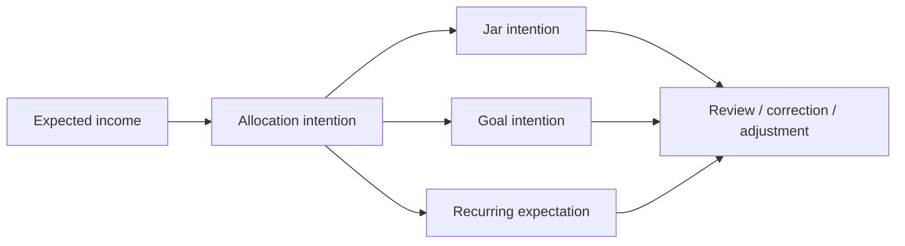
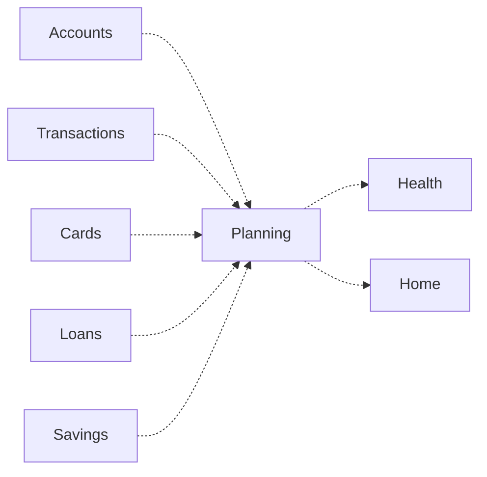

# Money Flow

## Principle

Planning does not move money.

Planning changes intention. Real money movement belongs to Accounts, Transactions, Cards, Loans, Savings, or external providers depending on the business fact.

## Real Ledger

Real Ledger flow:

Business behavior:

- Salary received is a real transaction.
- Expense paid is a real transaction.
- Card repayment is real ledger and card obligation behavior.
- Loan payment is real ledger and loan obligation behavior.
- Savings funding, withdrawal, renewal, or maturity belongs to Savings and Transactions.
- Planning may read these facts but cannot create them as real money movement.

## Planning

Virtual Planning flow:

Business behavior:

- Allocating to a jar does not subtract from an account.
- Completing a goal does not prove savings balance.
- Reallocating during emergency does not transfer money.
- Due pressure does not prove payment.
- Calendar projection does not forecast guaranteed cash.

## Inbox

Inbox flow:

Business behavior:

- Inbox may carry planning-related decisions when human review is needed.
- Inbox does not own Planning intention.
- Inbox does not move money.
- Resolution may clarify Planning but cannot mutate source-domain facts.

## Read-Only

Read-only flow:

Business behavior:

- Planning consumes facts for context.
- Health may read Planning and facts.
- Health cannot change Planning.
- Home may summarize Plan pulse, but must not label planned amounts as bank balance.

## Prohibited Money Flow

Forbidden:

- Jar allocation as account transfer.
- Goal progress as savings product balance.
- Recurring expectation as paid transaction.
- Emergency reallocation as real withdrawal.
- Calendar projection as confirmed provider obligation.
- Health insight as Planning mutation.
- AI explanation as autonomous financial action.
