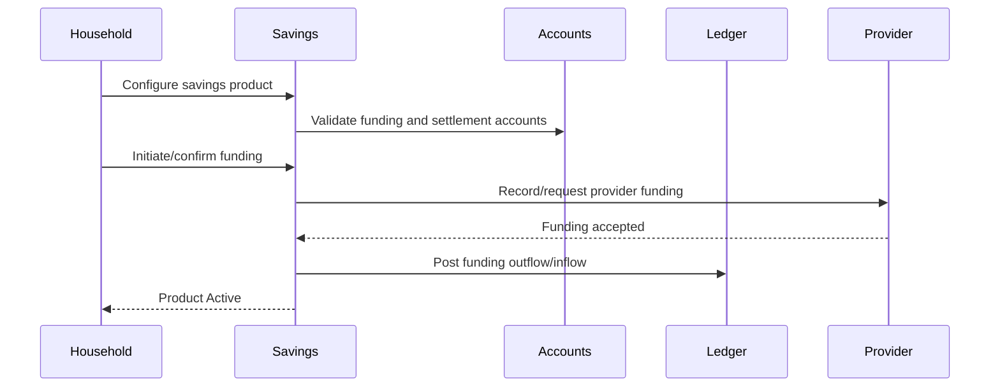
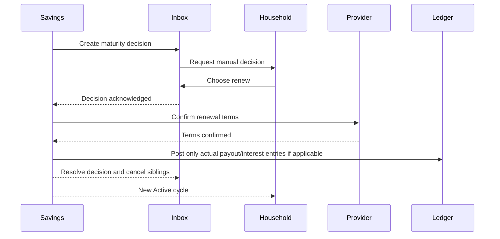
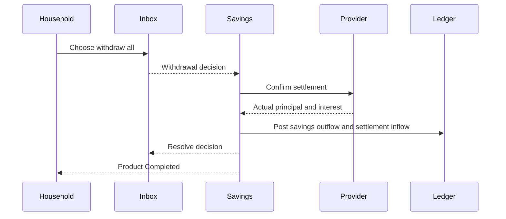
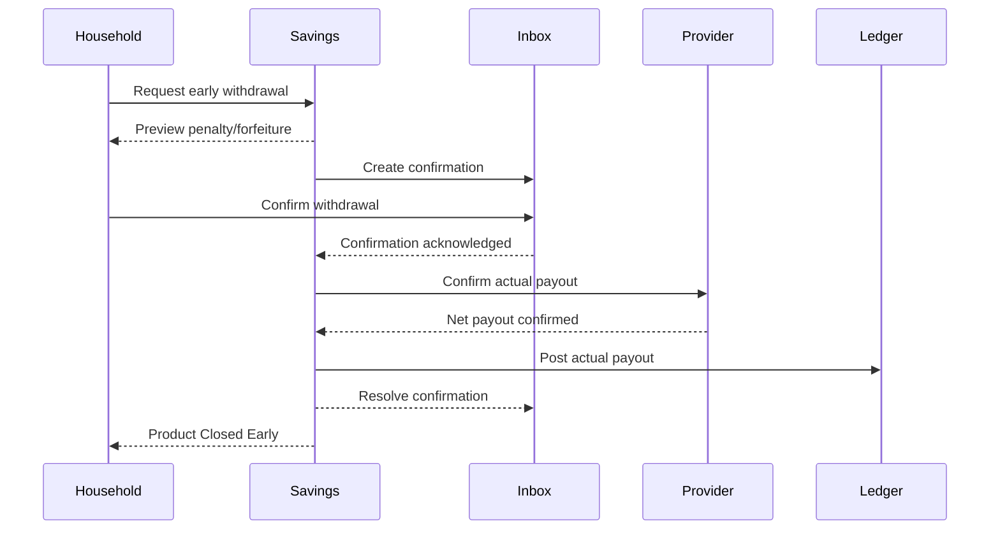
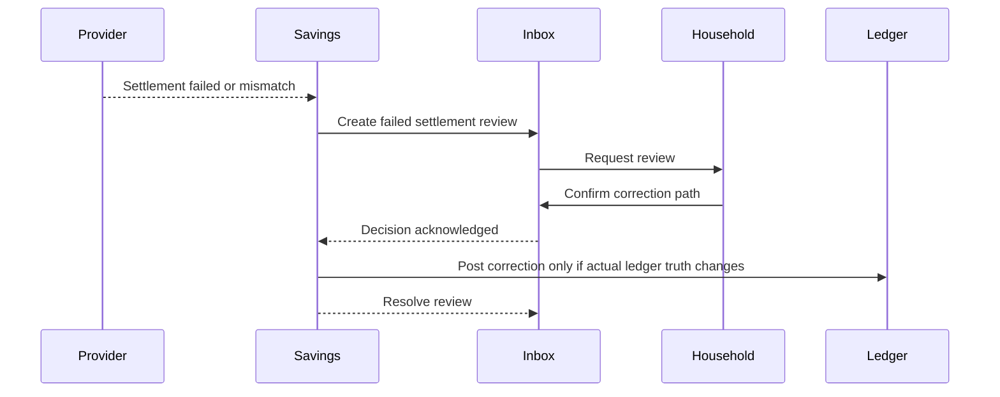

# Sequence Diagrams

## Funding

```mermaid
sequenceDiagram
  participant H as Household
  participant S as Savings
  participant A as Accounts
  participant L as Ledger
  participant P as Provider
  H->>S: Configure savings product
  S->>A: Validate funding and settlement accounts
  H->>S: Initiate/confirm funding
  S->>P: Record/request provider funding
  P-->>S: Funding accepted
  S->>L: Post funding outflow/inflow
  S-->>H: Product Active
```

## Maturity Renewal

```mermaid
sequenceDiagram
  participant S as Savings
  participant I as Inbox
  participant H as Household
  participant P as Provider
  participant L as Ledger
  S->>I: Create maturity decision
  I->>H: Request manual decision
  H->>I: Choose renew
  I-->>S: Decision acknowledged
  S->>P: Confirm renewal terms
  P-->>S: Terms confirmed
  S->>L: Post only actual payout/interest entries if applicable
  S-->>I: Resolve decision and cancel siblings
  S-->>H: New Active cycle
```

## Full Withdrawal

```mermaid
sequenceDiagram
  participant H as Household
  participant I as Inbox
  participant S as Savings
  participant P as Provider
  participant L as Ledger
  H->>I: Choose withdraw all
  I-->>S: Withdrawal decision
  S->>P: Confirm settlement
  P-->>S: Actual principal and interest
  S->>L: Post savings outflow and settlement inflow
  S-->>I: Resolve decision
  S-->>H: Product Completed
```

## Early Withdrawal

```mermaid
sequenceDiagram
  participant H as Household
  participant S as Savings
  participant I as Inbox
  participant P as Provider
  participant L as Ledger
  H->>S: Request early withdrawal
  S-->>H: Preview penalty/forfeiture
  S->>I: Create confirmation
  H->>I: Confirm withdrawal
  I-->>S: Confirmation acknowledged
  S->>P: Confirm actual payout
  P-->>S: Net payout confirmed
  S->>L: Post actual payout
  S-->>I: Resolve confirmation
  S-->>H: Product Closed Early
```

## Failed Settlement Review

```mermaid
sequenceDiagram
  participant P as Provider
  participant S as Savings
  participant I as Inbox
  participant H as Household
  participant L as Ledger
  P-->>S: Settlement failed or mismatch
  S->>I: Create failed settlement review
  I->>H: Request review
  H->>I: Confirm correction path
  I-->>S: Decision acknowledged
  S->>L: Post correction only if actual ledger truth changes
  S-->>I: Resolve review
```

