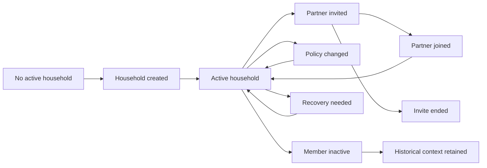

# Lifecycle

## Lifecycle Overview

## Beginning

The lifecycle begins when an authenticated user creates a household or accepts an invitation into a household.

Business meaning:

- A household becomes the shared financial unit.
- The first active member establishes the initial household boundary.
- The household must have enough recognition context to be understood by its members.

## Normal Operation

During normal operation:

- The household remains active.
- Active members can be recognized.
- Partners share daily Money, Plan, and Inbox participation.
- Admin responsibility is limited to elevated household policy behavior.
- Other domains use the household boundary to scope records.
- Current household policies remain visible to members.

## Changes

Allowed changes:

- Invite a partner.
- Accept invitation.
- Decline invitation.
- Revoke pending invitation.
- Let an invitation expire.
- Update household policy.
- Update household preferences.
- Update simple member recognition identity.
- Record recent material policy context.
- Represent a member as inactive for historical interpretation.

## Completion

Together does not have a normal "complete" state. It is long-lived household infrastructure.

Completion occurs only for specific subflows:

- Invitation accepted, declined, revoked, or expired.
- Policy change recorded and current policy updated.
- Preference change accepted.
- Historical member context retained.

## Termination

Full household closure, member departure workflows, separation, and household split are deferred product decisions.

Current blueprint business treatment:

- A household may cease being the active household for a user only through approved membership status behavior.
- Historical interpretation must not be erased merely because a member is no longer active.

## Recovery

Recovery occurs when:

- A user has no active household.
- An invitation is expired, revoked, declined, or invalid.
- A member identity is unclear.
- Policy context is unclear.
- Household membership state cannot be interpreted.

Recovery expectation:

- Business state must return to a valid household, valid invitation end state, or clear no-active-household state.

## Exceptional Situations

Exceptional situations include:

- Wrong invite recipient.
- Email mismatch.
- Existing active household.
- Household member limit reached.
- Member becomes inactive.
- Policy changed during household stress.
- Relationship conflict.
- Safety-sensitive shared visibility concern.

Together preserves clear business facts. It does not resolve relationship conflict.
