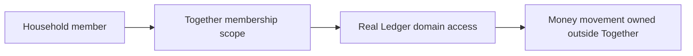
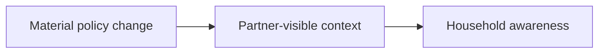

# Money Flow

Together does not move money.

## Real Ledger

Real Ledger money movement belongs to Accounts, Transactions, Cards, Loans, and Savings.

Together behavior:

- Confirms whether the actor belongs to the household.
- Provides household scope.
- Does not create income, expense, transfer, balance, refund, correction, withdrawal, or settlement.

## Planning

Planning is virtual intention. Together may hold policy assumptions that Planning reads.

Together behavior:

- Holds current household policy state.
- Does not allocate jars.
- Does not move planned money.
- Does not convert policy into real money movement.

## Inbox

Inbox owns household attention and review items.

Together behavior:

- May produce material policy context.
- Does not own Inbox resolution.
- Does not decide financial outcome.

## Read-Only

Health and other read-only summaries may use household scope.

Together behavior:

- Defines who can see household-scoped read-only information.
- Does not calculate Health.
- Does not allow Health or AI to mutate money.

## BR-01 Protection

Together is neither Real Ledger nor Virtual Planning. It is the trust boundary around both.

No Together flow may:

- Move real money.
- Create or correct transactions.
- Allocate jars.
- Fund goals.
- Change account balances.
- Trigger automatic money movement.
