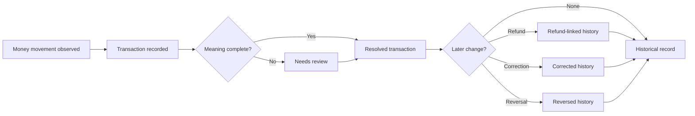

# Lifecycle

## Business Lifecycle

## Beginning

The lifecycle begins when real money movement occurs or is intentionally recorded by the household.

Valid beginnings:

- Money enters an active account.
- Money leaves an active account.
- Money moves between household-owned accounts.
- A refund, reversal, or correction event relates to a previous transaction.

Invalid beginnings:

- A plan, jar allocation, goal intention, bill reminder, or Health signal without real money movement.
- Provider, AI, or user suggestion that does not correspond to a money event.

## Normal Operation

In normal operation:

1. A transaction is recorded with required factual anchors.
2. The transaction affects real ledger understanding.
3. If household meaning is complete, the transaction is resolved.
4. If meaning is incomplete, the transaction needs review.
5. The transaction remains available in chronological history.

## Changes

Allowed business changes:

- Add or clarify household note.
- Add or change category meaning.
- Add or change planning reference without moving real money.
- Mark unresolved activity as reviewed.
- Add refund, correction, or reversal relationship.

Forbidden business changes:

- Silently overwrite financial truth.
- Turn a transaction into virtual planning movement.
- Let Health mutate the transaction.
- Treat provider or AI suggestion as authoritative without household-understood truth.

## Completion

A transaction is complete when:

- Required factual anchors are present.
- The transaction's money direction is understood.
- Account impact is explainable.
- Any required household review is resolved or intentionally left unresolved as historical uncertainty.

## Termination

Transactions do not terminate by deletion in business meaning. They leave active concern by becoming historical, reversed, corrected, or refund-linked.

## Recovery

Recovery occurs when a transaction is wrong, unclear, duplicated, refunded, or reversed.

Recovery must preserve a truthful business story:

- What was originally recorded.
- What later clarified or changed.
- Why the household should trust the current interpretation.

## Exceptional Situations

Exceptional situations include missing account, invalid amount, unclear transfer, duplicate attempt, refund without original, correction conflict, offline mutation, and boundary-breaking attempts.

In all exceptional situations, the previous valid business state remains intact unless a valid recovery action explains the change.
