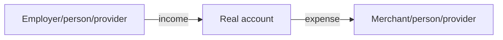
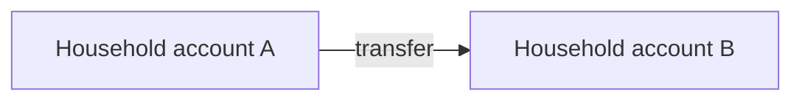
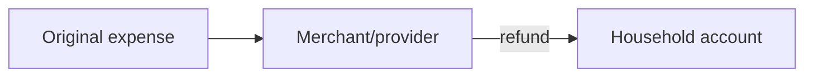
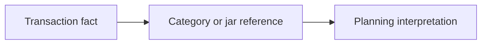
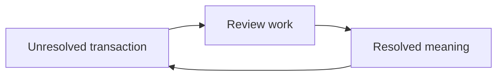

# Money Flow

## Real Ledger

Transactions affect real ledger understanding only when real money moves.

Expense:

- Money leaves a real account.
- Household real position decreases unless offset by another real event.
- Category or jar meaning does not move money.

Income:

- Money enters a real account.
- Household real position increases unless it is a transfer, reimbursement, refund, or correction context.

Owned-account transfer:

- Money changes location.
- Household total real position is neutral by default.
- Transfer is not income or expense by default.
- Fees or exchange effects are separate real ledger meanings.

Refund:

- Returned money is real ledger movement.
- Refund is linked to prior expense meaning when identifiable.
- Refund is not ordinary income when it restores prior spending.

Correction or reversal:

- Correction changes the trusted business story while preserving audit truth.
- Reversal unwinds active meaning without erasing the original history.

## Planning

- Planning consumes transaction facts.
- Planning does not create transaction facts.
- Jar reference is virtual meaning and must not be treated as real money movement.

## Inbox

- Inbox consumes unresolved transaction questions.
- Inbox resolution clarifies meaning.
- Inbox does not erase or own the transaction fact.

## Read-Only

Read-only consumers:

- Health.
- Goals.
- Together.
- Reports or summaries.
- Future provider or AI assistance.

Read-only behavior:

- Read transaction facts.
- Interpret or summarize.
- Do not create, mutate, correct, or reverse ledger truth.
