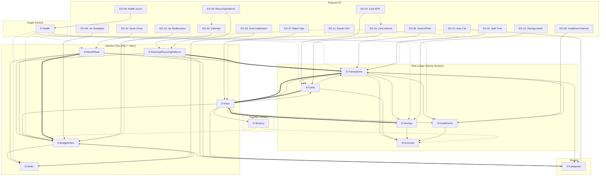

# Business Interaction Graph

**Board:** Business Cohesion & Money Lifecycle Board  
**Date:** 2026-08-03  
**Post-R1 Graph:** Includes approved R1 features, BR-01–BR-27, and Health-RO constitutional invariant.

**SoT note:** Product BR-14 = AI non-invention. Health read-only is labeled **Health-RO** in this graph (see `business-smells.md` Smell 12.2).

---

## Node Types

| Type | Symbol | Description |
|------|--------|-------------|
| Domain | `[D]` | Bounded context owning business capabilities |
| Feature | `[F]` | Approved feature (EO-XX) |
| Business Rule | `[BR]` | Governing rule (BR-XX) |
| User Decision | `[UD]` | Human decision point |
| Money State | `[MS]` | State of money in the system |
| Financial Event | `[FE]` | Event that changes money state |
| System Event | `[SE]` | Automated system trigger |
| User Intention | `[UI]` | User's stated intention |
| Household Actor | `[HA]` | Persona / role |

## Edge Types

| Type | Symbol | Description |
|------|--------|-------------|
| Reads | `-->>` | Domain reads data from another domain |
| Writes | `-->>` | Domain writes data to another domain |
| Influences | `-.->` | One domain influences behavior of another |
| Triggers | `==>` | Event/rule triggers action in a domain |
| Depends On | `-->` | Structural dependency |
| Reviews | `~~>` | One domain reviews output of another |
| Summarizes | `~~>` | Domain summarizes data from another |
| Forecasts | `~~>` | Domain predicts based on another's data |
| Protects | `--[P]--` | Domain enforces constraint on another |
| Validates | `--[V]--` | Domain validates data from another |
| Completes | `--[C]--` | Domain completes a lifecycle for another |

---

## Textual Graph

### Real Ledger Domain Cluster

```
[D:Accounts] --[P]--> [BR-01: Real ≠ Virtual]
[D:Transactions] --> [D:Accounts]  (reads account balance)
[D:Transactions] --> [D:Categories]  (reads category tags)
[D:Transactions] --> [D:Cards]  (reads card for payment instrument)
[D:Transactions] --> [D:Installments]  (reads installment payment schedule)
[D:Transactions] --> [D:Savings]  (reads savings product for maturity)
[D:Cards] --> [D:Accounts]  (reads linked account)
[D:Cards] --> [D:Transactions]  (reads spending history)
[D:Savings] --> [D:Accounts]  (reads linked account)
[D:Installments] --> [D:Accounts]  (reads linked account)
[D:Installments] --> [D:Transactions]  (reads payment history)

[BR-17: Payment Reminder] ==> [D:Cards]  (triggers 3-day reminder)
[BR-18: Minimum Payment Visibility] --> [D:Cards]
[BR-22: Card Interest Cost] --> [D:Cards]
[BR-20: Installment Interest Transparency] --> [D:Installments]
[BR-21: Savings Maturity Notification] ==> [D:Savings]  (triggers 30/14/7 day alerts)
[BR-11: Installment Completion] --> [D:Installments]

[F:EO-02] --> [D:Cards]  (card payment due dates + min payment + APR)
[F:EO-12] --> [D:Savings]  (maturity alerts)
[F:EO-13] --> [D:Cards]  (interest cost display)
[F:EO-09] --> [D:Installments]  (interest visibility)
[F:EO-05] --> [D:Transactions]  (search/filter)
[F:EO-20] --> [D:Transactions]  (split support)
```

### Intention Plan Domain Cluster

```
[D:Budgets/Jars] --[P]--> [BR-01: Real ≠ Virtual]
[D:Budgets/Jars] --[P]--> [BR-03: Allocations target Active jars]
[D:Budgets/Jars] --> [D:Categories]  (reads category for jar naming)
[D:Budgets/Jars] --> [D:Goals]  (reads goal funding targets)
[D:Goals] --> [D:Budgets/Jars]  (reads jar allocation amounts)
[D:Planning/RecurringPatterns] --> [D:Budgets/Jars]  (reads jars for auto-allocation)
[D:Planning/RecurringPatterns] --> [D:Categories]  (reads categories for patterns)
[D:MonthRitual] --> [D:Budgets/Jars]  (reviews jar performance)
[D:MonthRitual] --> [D:Goals]  (reviews goal progress)
[D:MonthRitual] --> [D:Transactions]  (reviews spending)
[D:MonthRitual] --> [D:Categories]  (reviews category spending)

[BR-04: Income Placement] --> [D:Planning/RecurringPatterns]  (governs auto-allocation)
[BR-06: Movement Magnitudes Positive] --> [D:Budgets/Jars]
[BR-07: Overspend Policy] --> [D:Budgets/Jars]
[BR-08: Month Ritual Locks Plan] --> [D:Budgets/Jars]
[BR-09: Month Ritual Defaults Assisted] --> [D:MonthRitual]
[BR-19: Jar Template Application] --> [D:Budgets/Jars]
[BR-23: Quick Close Eligibility (6 rituals)] --> [D:MonthRitual]
[BR-24: Quick Close Mandatory Summary] --> [D:MonthRitual]

[F:EO-03] --> [D:Planning/RecurringPatterns]  (calendar view)
[F:EO-01] --> [D:Categories]  (auto-categorization)
[F:EO-06] --> [D:Budgets/Jars]  (jar templates)
[F:EO-08] --> [D:Health]  (health score iteration)
[F:EO-10] --> [D:MonthRitual]  (quick close)
[F:EO-18] --> [D:Goals]  (goal celebration)
[F:EO-19] --> [D:Budgets/Jars]  (jar reallocation)
```

### Inbox Domain Cluster (Integration Hub)

```
[D:Inbox] --> [D:Transactions]  (reads unmapped expenses, BR-05)
[D:Inbox] --> [D:Savings]  (reads maturity events, BR-10)
[D:Inbox] --> [D:Cards]  (reads payment reminders, BR-17)
[D:Inbox] --> [D:Installments]  (reads completion events, BR-11)
[D:Inbox] --> [D:Budgets/Jars]  (resolves to jars)
[D:Inbox] --> [D:Categories]  (reads categories for mapping)
[D:Inbox] --> [D:Tenancy]  (reads household membership for visibility)

[BR-05: Unmapped → Inbox] ==> [D:Inbox]
[BR-10: Savings Maturity → Inbox] ==> [D:Inbox]
[BR-16: Auto-Cat Override] --> [D:Inbox]

[F:EO-07] --> [D:Inbox]  (batch operations)
[F:EO-04] -.-> [D:Inbox]  (RecurringPatterns generate Inbox items for review)
```

### Tenancy Domain Cluster

```
[D:Tenancy] --> [D:Accounts]  (reads household accounts)
[D:Tenancy] --> [D:Budgets/Jars]  (reads household jars)
[D:Tenancy] --[P]--> [BR-02: Auth + Membership Required]
[D:Tenancy] --[P]--> [BR-02a: RLS Enforcement]
[D:Tenancy] --[P]--> [BR-02b: Single Account per Email]
[D:Tenancy] --[P]--> [BR-12: One Active Household]
[D:Tenancy] --[P]--> [BR-13: Policy Changes Partner-Visible]
```

### Health Domain Cluster (Read-Only Mirror)

```
[D:Health] ~~> [D:Transactions]  (summarizes spending)
[D:Health] ~~> [D:Budgets/Jars]  (summarizes jar performance)
[D:Health] ~~> [D:Goals]  (summarizes goal progress)
[D:Health] ~~> [D:Savings]  (summarizes savings growth)
[D:Health] ~~> [D:Cards]  (summarizes card utilization)
[D:Health] ~~> [D:Installments]  (summarizes debt reduction)
[D:Health] ~~> [D:MonthRitual]  (summarizes monthly outcome)
[D:Health] --[P]--> [Health-RO: Health is Read-Only]
[D:Health] --[P]--> [BR-14 Product: AI non-invention]  (also applies; SoT ID collision — see smells)

[F:EO-08] --> [D:Health]  (score iteration)
```

### Shared Infrastructure

```
[D:Categories] --> [D:Transactions]  (used for classification)
[D:Categories] --> [D:Budgets/Jars]  (used for jar mapping)
[D:Categories] --> [D:Goals]  (used for goal categorization)
[D:Categories] --> [D:Planning/RecurringPatterns]  (used for pattern rules)

[F:EO-01] --> [D:Categories]  (auto-categorization)
[BR-16: Auto-Cat Override] --> [D:Categories]
```

### Cross-Domain Integration Flows

```
[D:Transactions] =WRITES=> [D:Inbox]  (unmapped transaction → ReviewItem, BR-05)
[D:Savings] =TRIGGERS=> [D:Inbox]  (maturity alert → ReviewItem, BR-10)
[D:Cards] =TRIGGERS=> [D:Inbox]  (payment due → ReviewItem, BR-17)
[D:Inbox] =WRITES=> [D:Budgets/Jars]  (resolved item → jar allocation)
[D:Budgets/Jars] =WRITES=> [D:Goals]  (jar allocation → goal funding)
[D:Planning/RecurringPatterns] =TRIGGERS=> [D:Transactions]  (pattern → transaction)
[D:MonthRitual] =LOCKS=> [D:Budgets/Jars]  (approved ritual → jar freeze, BR-08)
[D:Health] =READS=> ALL  (read-only summarization, BR-14)
[D:Tenancy] =PROTECTS=> ALL  (auth + membership gate, BR-02)
```

### Feature Dependency Chain (from Decision Board)

```
[F:EO-04: RecurringPatterns] --> [F:EO-03: Calendar]  (calendar from patterns)
[F:EO-02: Card APR] --> [F:EO-13: Card Interest Cost]  (interest needs APR)
[F:EO-01: Auto-Categorization] --> [F:EO-16: Auto-Resolution R2]  (auto-resolution builds on auto-cat)
[F:EO-08: Health R1] --> [F:EO-08: Health R2 Future]  (R2 insights need R1 iteration)
```

---

## Mermaid Diagram



---

## Critical Path Analysis

### Domains on the Critical Path (if they fail, ViNha fails)

| Domain | Reason |
|--------|--------|
| **Accounts** | Money has no home without accounts |
| **Transactions** | No financial truth without transactions |
| **Inbox** | Bridge between Real and Intention breaks |
| **Categories** | No classification without categories |
| **Tenancy** | No access without auth + membership |

### Domains That Can Function in Isolation

| Domain | Isolation Viability |
|--------|---------------------|
| **Health** | Can show empty state; no mutations needed |
| **Goals** | Can exist without jar funding (aspirational only) |
| **Cards** | Can be created without transactions (pre-loaded data) |

---

## Graph Statistics

| Metric | Count |
|--------|-------|
| Domain nodes | 13 |
| Feature nodes | 15 |
| Business Rule nodes | 24 |
| User Decision nodes | 10 (see decision-lifecycle) |
| Money State nodes | 12 (see money-lifecycle) |
| Domain-to-Domain edges | 42 |
| Domain-to-Feature edges | 19 |
| Feature-to-Feature edges | 4 |
| Rule-to-Domain edges | 18 |
| Cross-domain trigger edges | 5 |
| Total nodes | ~85 |
| Total edges | ~88 |
