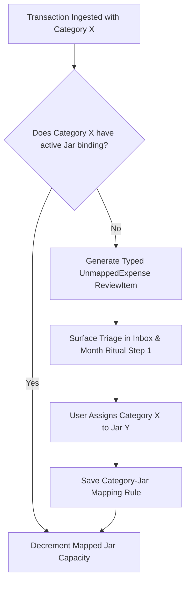

# Category ↔ Jar Mapping Contract Specification — ViNha Business Evolution Board

**Board:** Business Evolution Board  
**Date:** 2026-08-03  
**Status:** APPROVED  

---

## 1. Executive Rationale

Categories classify real-world ledger transactions, while Jars track virtual household planning intentions. In the initial specification, no binding contract governed their relationship. Categories could be created with names that diverged from active Jars, leaving transactions categorized but unmapped to any spending intention (Business Smell 5.1, 10.1, 15.1; Reality Validation DNI-02).

The **Category ↔ Jar Mapping Contract** establishes a strict cross-domain authority model that binds transaction classification directly to spending intentions (**BR-12**).

---

## 2. Mapping Contract Architecture

```
+-------------------------------------------------------------------------+
|                        JAR TAXONOMY PRIMACY                             |
|   Jars represent household spending intentions (e.g. "Transport Jar")   |
+-------------------------------------------------------------------------+
                                    |
                                    | N : 1 Mapping Contract (BR-12)
                                    v
+-------------------------------------------------------------------------+
|                     CATEGORY CLASSIFICATION LAYER                       |
|   Categories map to Jars:                                               |
|   - "Taxi & Rideshare" ---------\                                      |
|   - "Fuel & Petrol" ------------+---> Map to "Transport Jar"           |
|   - "Parking & Tolls" ----------/                                      |
+-------------------------------------------------------------------------+
```

---

## 3. Core Contract Rules & Governance

### Rule 1: $N:1$ Binding Constraint
- Multiple Categories MAY map to a single Jar (e.g., "Taxi", "Fuel", and "Parking" categories all map to "Transport Jar").
- NO Category may exist without an active Jar binding.
- A Category CANNOT map to multiple Jars simultaneously.

### Rule 2: Jar Primacy & Taxonomy Authority
- Jars hold structural primacy in household money management.
- Creating a new Jar automatically generates a default matching Category with identical naming.
- Renaming or archiving a Jar prompts the user to re-map or archive its associated Categories.

### Rule 3: Category Creation Enforcement
- When a user creates a new Category (e.g., "Pet Grooming"), the UI MUST require selecting an existing active Jar (e.g., "Pet Care Jar") or creating a new Jar inline.
- Direct database inserts or API calls that attempt to create an unmapped Category are REJECTED with a validation error (`ERR_CATEGORY_UNMAPPED`).

---

## 4. Divergence Detection & Resolution Protocol



1. **Inbox Triage**: If an external transaction arrives with an unmapped category, Inbox generates a typed `UnmappedExpense` ReviewItem.
2. **Month Ritual Step 1 (Divergence Gate)**: Step 1 of the Month Ritual scans all transactions posted in the month. If any transaction category lacks an active Jar binding, the ritual surfaces a mapping prompt and blocks progression to Step 2 until resolved.
