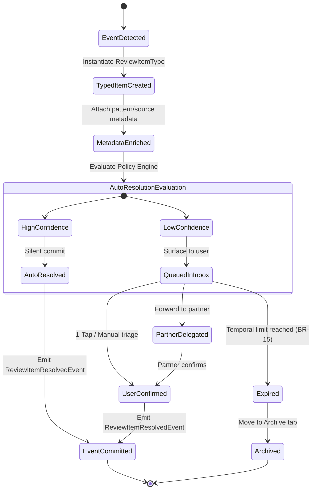

# Decision Lifecycle v2 — ViNha Business Evolution Board

**Board:** Business Evolution Board  
**Date:** 2026-08-03  
**Status:** APPROVED  

---

## 1. Inbox as a Pure Decision Queue

In ViNha Business Model v2, the **Inbox domain is strictly a Decision Queue**, NOT a general notification center. 

Every entry in the Inbox represents an actionable financial decision requiring household attention, partner confirmation, or automated policy evaluation. Background notifications, marketing messages, or static alerts belong to notification surfaces, keeping the Inbox decision queue pristine.

---

## 2. Decision State Machine Architecture

---

## 3. Decision Types & Resolution Contracts

| ReviewItem Type | Trigger Origin | Decision Question | Resolution Options | Auto-Resolution Policy |
|---|---|---|---|---|
| `UnmappedExpense` | Ingested transaction with unknown category/jar | "Which Jar does this expense belong to?" | 1. Assign existing Jar 2. Split across Jars 3. Create new Jar | High-confidence merchant rules or pattern metadata match. |
| `MaturityDecision` | Savings account maturity date approaching (BR-10) | "What should we do with maturing funds?" | 1. Reinvest in new CD 2. Transfer to Checking 3. Allocate to Goal Jar | Manual confirmation required; cancels pending alert cascade (BR-21). |
| `PaymentReminder` | Credit card billing due date approaching (BR-17) | "Have you scheduled this card payment?" | 1. Mark as Paid 2. Schedule Payment 3. Snooze (max 3 days) | Expire 7 days post due date; move to Archive. |
| `InstallmentComplete` | Final installment payoff completed (BR-11) | "Debt paid off! Where should freed cash flow go?" | 1. Reallocate to Savings Jar 2. Fund active Goal 3. Dismiss | Manual household decision; triggers celebration. |
| `EmergencyDeclaration` | Mid-month overspend marked as emergency | "Acknowledge mid-month emergency spending?" | 1. Acknowledge & annotate 2. Re-balance Jars | Requires partner visibility; queued for Month Ritual. |

---

## 4. Household Collaboration & Partner Delegation

In multi-member households:
1. **Shared Decision Items**: Items involving shared household accounts appear in both partners' Inboxes.
2. **Single Decision Confirmation**: Once either partner resolves a shared decision item, it is marked `ResolvedByPartner` in the other partner's Inbox.
3. **Emergency Transparency**: Emergency declarations made by one partner immediately notify the other partner with full intent notes (**BR-13**).
