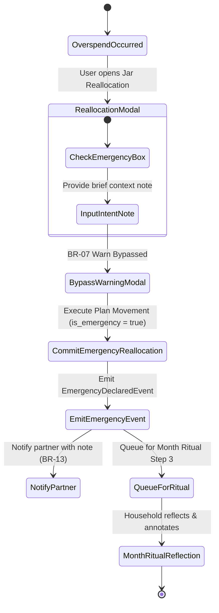

# Emergency Lifecycle Specification — ViNha Business Evolution Board

**Board:** Business Evolution Board  
**Date:** 2026-08-03  
**Status:** APPROVED  

---

## 1. Context & Business Problem

In real life, households encounter unavoidable emergency expenses (e.g., urgent car repairs, medical bills, appliance replacements). In the initial model, an emergency overspend and a discretionary overspend (e.g., dining out too much) were treated identically by **BR-07 Warn**.

Both generated identical warning modals and mid-month alerts, causing user frustration and hiding genuine financial distress (Lifecycle Gap 3; Business Smell 6.2).

The **Emergency Lifecycle** introduces an explicit `EmergencyDeclaration` mechanism that bypasses mid-month friction while preserving long-term reflection and accountability.

---

## 2. Emergency Flow State Machine

---

## 3. Operational Rules & Constraints

1. **Explicit Intent Flag**: To classify a plan movement as an emergency, the user MUST check "Declare Emergency" and enter a mandatory 1-sentence note (e.g., *"Car alternator broke down on highway"*).
2. **BR-07 Warning Bypass**: When `is_emergency = true`, the system BYPASSES the standard mid-month overspend warning dialog. The plan reallocation commits instantly without friction.
3. **Immediate Partner Notification**: Because emergency spending impacts household safety, an emergency declaration automatically generates a high-priority notice for the partner's device (**BR-13**).
4. **Month Ritual Step 3 Isolation**: During Step 3 of the Month Ritual, all emergency reallocations are isolated into a dedicated "Emergency Spending & Reflection" section. The household reviews total emergency expenditure, discusses whether emergency funds were sufficient, and decides if future monthly Jar baselines should be adjusted.
5. **No Synthetic Emergency Balance**: Emergencies DO NOT create negative debt accounts or synthetic balances; they reallocate existing Jar capacity or draw from an Emergency Fund Jar, preserving **BR-01**.
