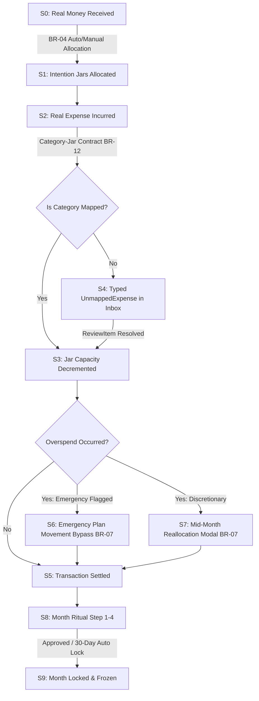

# Master Money Lifecycle v2 — ViNha Business Evolution Board

**Board:** Business Evolution Board  
**Date:** 2026-08-03  
**Status:** APPROVED  

---

## 1. Core Money Architecture

ViNha's money model operates on two strictly separated layers (enforcing **BR-01**):

```
+-------------------------------------------------------------------------+
|                          REAL LEDGER LAYER                              |
|   Bank Accounts · Cash · Credit Cards · Physical Transactions          |
+-------------------------------------------------------------------------+
                                   ||  (BR-05 / BR-12 Mapping Bridge)
                                   \/
+-------------------------------------------------------------------------+
|                        VIRTUAL INTENTION PLAN                           |
|   Jars · Income Allocation Rules · Monthly Spending Capacity           |
+-------------------------------------------------------------------------+
```

1. **Real Ledger Layer**: Tracks physical money movements across checking, savings, credit card accounts, and cash. Every entry is immutable, timestamped, and auditable.
2. **Virtual Intention Plan Layer**: Tracks household planning capacity distributed into virtual Jars. Represents money *purpose* and *intent*, not bank account balances.

---

## 2. End-to-End Master Money Lifecycle v2



---

## 3. Detailed Lifecycle State Transitions

### S0: Real Money Ingestion
- **Trigger**: Bank feed import, manual income entry, recurring income pattern.
- **Ledger Impact**: Real account balance increases (checking/cash).
- **Domain**: Accounts / Transactions.

---

### S1: Intention Allocation
- **Trigger**: Income entry triggers BR-04.
- **Plan Impact**: Virtual funds distributed into active Jars (e.g., Needs, Savings, Discretionary) based on household rule or manual assignment.
- **Domain**: Planning / Budgets.

---

### S2: Real Expense Incurred
- **Trigger**: Merchant payment via card or cash.
- **Ledger Impact**: Bank balance decrements or card balance increments.
- **Domain**: Transactions.

---

### S3: Jar Capacity Decremented
- **Trigger**: Transaction category mapped to active Jar.
- **Plan Impact**: Jar spending capacity decremented by transaction amount.
- **Domain**: Budgets / Jars.

---

### S4: Inbox Triage (`UnmappedExpense`)
- **Trigger**: Category unmapped to any Jar or unknown payee.
- **Inbox Impact**: Typed `UnmappedExpense` ReviewItem generated.
- **Action**: User or pattern rule assigns Category/Jar.

---

### S5: Transaction Settled
- **Trigger**: Jar capacity decremented cleanly or triage resolved.
- **State**: Transaction posted and mapped.

---

### S6: Emergency Reallocation
- **Trigger**: Overspend with `EmergencyDeclaration`.
- **Plan Impact**: Capacities reallocated between Jars; BR-07 warning bypassed; tagged for Month Ritual reflection.

---

### S7: Mid-Month Reallocation
- **Trigger**: Discretionary overspend.
- **Plan Impact**: BR-07 overspend warning modal pops up; user reallocates capacity from another Jar.

---

### S8 & S9: Month Ritual & Month Lock
- **Trigger**: Month-end review or 30-day temporal timeout.
- **Plan Impact**: Ritual approved or auto-locked (`PendingReview`); Jars locked against retro-active editing; health snapshot recorded (`BR-24`).
