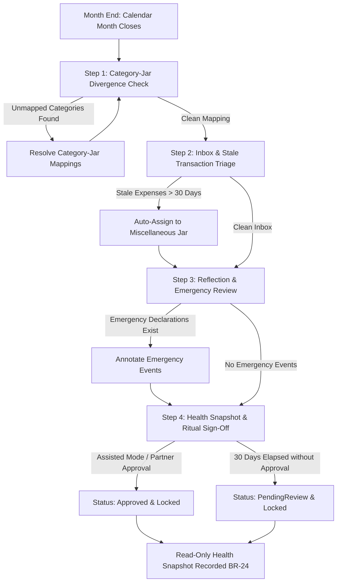

# Month Ritual Lifecycle v2 — ViNha Business Evolution Board

**Board:** Business Evolution Board  
**Date:** 2026-08-03  
**Status:** APPROVED  

---

## 1. Month Ritual Philosophy

The **Month Ritual** is ViNha's core reflection and closure loop. It is where real-world financial events meet household planning intent. 

In Business Model v2, the Month Ritual is evolved to incorporate:
1. **30-Day Temporal Auto-Lock**: Ensures past months cannot remain open indefinitely (**BR-08**).
2. **Category-Jar Divergence Check**: Highlights unmapped spending categories (**EVO-01**).
3. **Emergency Reflection Surface**: Isolates declared emergency reallocations for household reflection (**EVO-06**).
4. **Quick Close Ritual Path**: Formally enables 1-tap ritual approval after 6 consecutive assisted rituals (**BR-23**).

---

## 2. Month Ritual v2 Workflow Architecture

---

## 3. Detailed Step-by-Step Specification

### Step 1: Category-Jar Divergence Check (EVO-01)
- **Objective**: Ensure 100% of spending in the completed month is mapped to active Jars.
- **System Action**: Scans all transactions posted in the month. If any transaction category lacks an active Jar binding, the ritual surfaces a mapping prompt and blocks progression to Step 2 until resolved.

---

### Step 2: Inbox & Stale Transaction Triage (EVO-07, EVO-10)
- **Objective**: Clear all pending decision queue items for the month.
- **System Action**: Displays remaining `UnmappedExpense` ReviewItems for the month. If the ritual is running at the 30-day auto-lock deadline, any remaining unmapped expenses are automatically resolved to the Miscellaneous Jar (**BR-08 / BR-15**).

---

### Step 3: Reflection & Emergency Review (EVO-06)
- **Objective**: Review non-standard financial events and foster constructive partner dialogue.
- **System Action**: Highlights all Jar reallocations executed with an `EmergencyDeclaration` during the month. Prompts both partners to review intent notes, add shared reflections, and discuss if base Jar allocations need adjustment for upcoming months.

---

### Step 4: Health Snapshot & Ritual Sign-Off (EVO-07, EVO-08)
- **Objective**: Freeze month allocations, record health analytics, and close the monthly accounting cycle.
- **Mode Execution**:
  - **Assisted Mode (Default, BR-09)**: Guided step-by-step walkthrough for households.
  - **Quick Close Mode (BR-23)**: Unlocked after 6 consecutive completed rituals; displays a 1-page financial summary card with 1-tap partner approval.
  - **30-Day Auto-Lock (BR-08)**: If unapproved 30 days post month-end, status transitions to `PendingReview`, locking all Jar allocations and category mappings against retro-active editing.
- **Health Action**: Takes a read-only snapshot of final month figures to update trend metrics and financial health scores (**BR-24 / Health-RO**).
