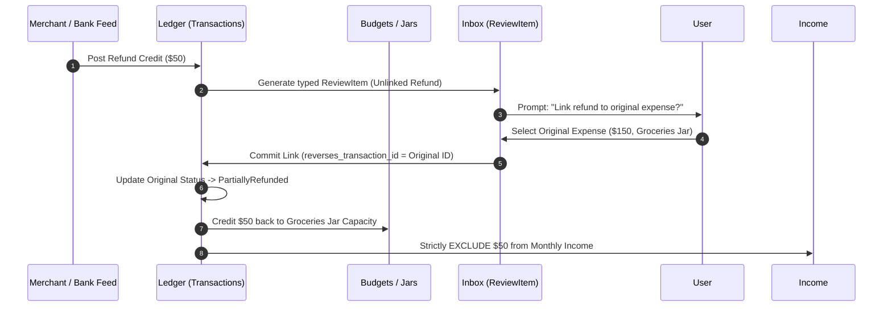

# Refund Lifecycle Specification — ViNha Business Evolution Board

**Board:** Business Evolution Board  
**Date:** 2026-08-03  
**Status:** APPROVED  

---

## 1. Context & Business Problem

In the initial specification, merchant refunds were recorded as raw incoming credit transactions without linking them back to the original outgoing expense transaction. This created significant accounting flaws:
1. **Income Inflation**: Refunds were miscounted as monthly income, distorting tax and cash flow reporting.
2. **Jar Capacity Loss**: The Jar that funded the original expense was not credited back, leaving the household's spending capacity artificially reduced.
3. **Audit Blind Spot**: Financial statements could not match refunds to their corresponding purchases (Lifecycle Gap 1; Business Smell 6.1).

The **Refund Lifecycle** resolves these issues by establishing a formal linkage contract between refund transactions and original expenses, enforcing **BR-02** and **BR-03**.

---

## 2. Refund Lifecycle Architecture



---

## 3. State Machine & Rules

```
+-------------------+      Link Selected       +-----------------------+
|  S0: Unlinked     | -----------------------> |  S1: Linked & Status  |
|  Refund Credit    |                          |  Updated              |
+-------------------+                          +-----------------------+
                                                           |
                                                           v
                                               +-----------------------+
                                               |  S2: Jar Capacity     |
                                               |  Restored & Income    |
                                               |  Excluded             |
                                               +-----------------------+
```

### State Definitions & Contracts

#### S0: Unlinked Refund Credit
- **Ingestion**: Ingested via bank feed or manual entry as a credit transaction.
- **Triage**: Surfaced in Inbox as a typed `UnmappedExpense` ReviewItem with a prompt: *"Is this a refund for a previous expense?"*

#### S1: Linked & Status Updated
- **Reference**: The refund transaction stores `reverses_transaction_id` referencing the original expense ID.
- **Original Transaction Status**:
  - If cumulative refund amount < original expense amount $\rightarrow$ status becomes `PartiallyRefunded`.
  - If cumulative refund amount = original expense amount $\rightarrow$ status becomes `FullyRefunded`.

#### S2: Jar Capacity Restored & Income Excluded
- **Jar Restoration**: The refund amount is credited directly back to the specific Jar assigned to the original transaction, restoring spending capacity.
- **Income Excluded**: The refund transaction is explicitly flagged as `is_reversal = true`, excluding it from total monthly income calculations.
