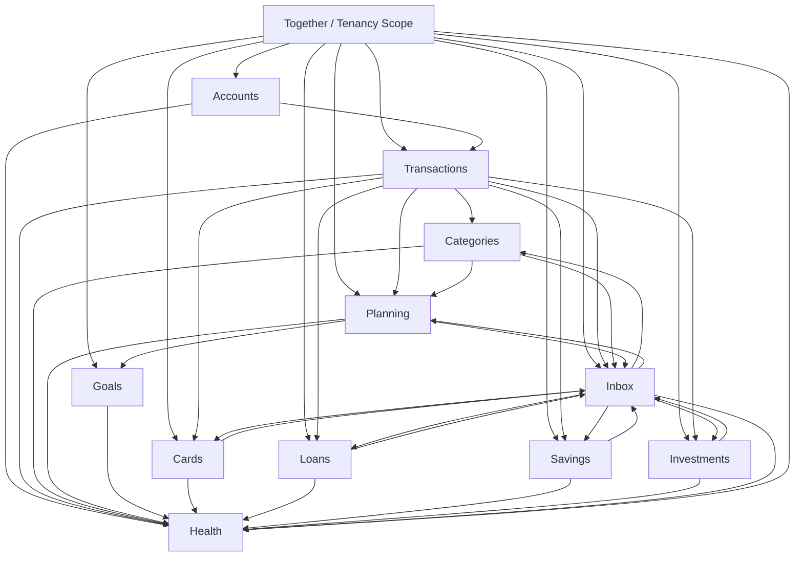

# Domain Dependency Graph

## Result

PASS WITH RECOMMENDATIONS

No business-level circular dependency is required by the source documents.

## Allowed Direction

## Interpretation

- Together may provide scope to every writable domain.
- Inbox may return decisions to source domains, but the source domain remains authoritative.
- Health is a terminal read-only consumer.
- Planning may read source facts but cannot mutate source facts.
- Product domains may read transaction evidence but cannot invent ledger movement.

## Forbidden Loops

- Health -> any operational domain.
- Planning -> Transactions as paid truth without real money event.
- Inbox -> Transactions, Cards, Loans, Savings, or Investments as financial truth without source-domain acceptance.
- Goals -> Savings, Transactions, or Accounts as proof of real funds.
- Investments -> Transactions from unrealized market value alone.

## Implementation Guard

Module import rules must reflect the business graph:

- Use application APIs and events for cross-domain collaboration.
- Do not import source-domain infrastructure or database rows directly.
- Enforce `ledger` not importing `plan`, `inbox`, or `health`.
- Enforce `plan` not importing `inbox` or `health`.
- Keep Health behind a read-only connection and read-only service interface.

